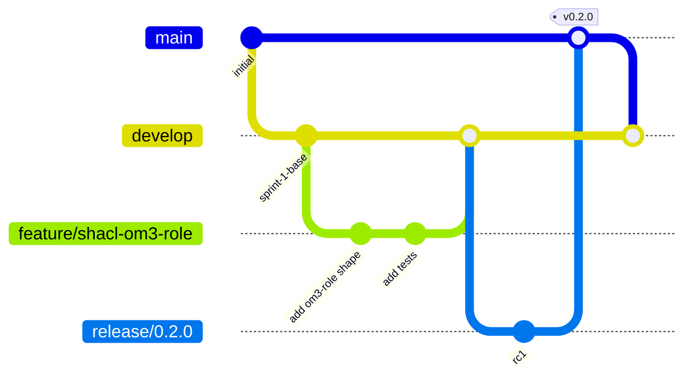

# CONTRIBUTING — Руководство для контрибьюторов ASG

> Документ описывает правила участия в разработке Адаптивного
> семантического шлюза (АСШ / ASG). Прочтите этот документ перед первой
> отправкой pull request.

## Содержание

- [Кодекс поведения](#кодекс-поведения)
- [Git workflow](#git-workflow)
- [Конвенция коммитов (Conventional Commits)](#конвенция-коммитов-conventional-commits)
- [Code style](#code-style)
  - [Scala (asg-core)](#scala-asg-core)
  - [Python (economics)](#python-economics)
  - [Lean 4 (TOI)](#lean-4-toi)
  - [Markdown / documentation](#markdown--documentation)
- [Pull request review process](#pull-request-review-process)
- [Тестирование](#тестирование)
- [Обновление документации](#обновление-документации)
- [Релизный процесс](#релизный-процесс)

---

## Кодекс поведения

Участники проекта соблюдают [Contributor Covenant 2.1](https://www.contributor-covenant.org/version/2/1/code_of_conduct/).
Кратко: уважительное общение, отсутствие дискриминации, фокус на
технических аргументах, признание ошибок.

Инциденты (harassment, toxicity) сообщать на `conduct@smev.ru`.

---

## Git workflow

Проект ведётся по упрощённому Git-flow:



### Ветви

| Ветвь           | Назначение                                        | Кто пушит            |
|-----------------|---------------------------------------------------|----------------------|
| `main`          | Production-ready код, то, что развернуто в prod   | Maintainers only     |
| `develop`       | Интеграционная ветвь (staging развернут отсюда)   | Maintainers + PRs    |
| `feature/*`     | Feature-branches для новых функций                | Любой контрибьютор    |
| `fix/*`         | Bugfix-branches                                   | Любой контрибьютор    |
| `release/*`     | Подготовка релиза (только bugfix, без features)   | Maintainers          |
| `hotfix/*`      | Срочные исправления в prod (из `main`)            | Maintainers          |

### Правила

1. **Никогда не пушить напрямую в `main` или `develop`.** Только через PR.
2. **Feature-ветки** именуются `feature/<kebab-case-name>`, например
   `feature/shacl-om3-role`, `feature/learner-llm-escalation`.
3. **Один PR = одна логическая задача.** Не смешивать фичу с рефакторингом
   и документацией (кроме сопутствующих правок).
4. **PR squash-merge** в `develop` — все коммиты объединяются в один с
   итоговым сообщением.
5. **PR description** должен заполняться по шаблону (см. ниже).

### Синхронизация с upstream

```bash
# Перед началом новой работы — обновить develop
git checkout develop
git pull --rebase origin develop

# Создать feature-ветку от актуального develop
git checkout -b feature/my-new-feature
```

---

## Конвенция коммитов (Conventional Commits)

Все коммиты следуют [Conventional Commits 1.0](https://www.conventionalcommits.org/):

```
<type>(<scope>): <subject>

<body>

<footer>
```

### Типы

| Type        | Когда использовать                                    |
|-------------|------------------------------------------------------|
| `feat`      | Новая функциональность (минорная версия +0.1)        |
| `fix`       | Bugfix (патч-версия +0.0.1)                          |
| `docs`      | Только документация (README, docs/, CHANGELOG)      |
| `style`     | Форматирование, отступы, точки с запятой (без логики)|
| `refactor`  | Рефакторинг без изменения API/поведения             |
| `perf`      | Оптимизация производительности                       |
| `test`      | Добавление/изменение тестов                          |
| `build`     | Изменения в build-системе (build.gradle.kts, Docker)|
| `ci`        | Изменения в CI/CD (`.github/workflows/`)             |
| `chore`     | Прочие рутинные задачи (зависимости, .gitignore)    |
| `revert`    | Откат предыдущего коммита                            |

### Scope (опционально)

| Scope       | Что покрывает                          |
|-------------|----------------------------------------|
| `api`       | REST/gRPC эндпоинты                    |
| `agents`    | Matcher/Arbiter/Learner/Validator     |
| `verification` | SHACL/OWL2RL/SPARQL                  |
| `cache`     | CacheManager, Redis                    |
| `registry`  | OntologyRegistry / MappingRegistry      |
| `helm`      | Helm-чарт                              |
| `k8s`       | Kubernetes-манифесты                   |
| `terraform` | Terraform-конфиг                       |
| `economics` | Python-скрипты экономики               |
| `toi`       | Lean 4 — TOI (Теорема 1.1)             |
| `shacl`     | SHACL-шейпы в `shapes/`                |
| `ontology`  | OWL-онтологии в `ontologies/`          |
| `security`  | RBAC, JWT, аудит                       |
| `observability` | Prometheus/Grafana/Loki/Jaeger    |

### Примеры

```
feat(agents): add LearnerAgent Hot-L escalation contour

Implements the third tier of the three-tier verification:
when confidence < 0.7, the request is escalated to the
LearnerAgent which stores it in PostgreSQL for manual
review (LLM-assisted resolution will be added in Sprint 3).

Closes #142.
```

```
fix(verification): ShaclValidator incorrectly cached violations

The validator cached the report keyed by data hash, but
did not include the shape path in the cache key, leading
to false positives when multiple shapes target the same
node.

Fixes #187.
```

```
chore(deps): bump akka-actor-typed_3 from 2.8.4 to 2.8.5
```

```
docs(monitoring): add LogQL examples for SHACL violation search
```

### Breaking changes

Если коммит содержит breaking change, добавить в footer `BREAKING CHANGE:`:

```
feat(api)!: rename /api/v1/translate to /api/v2/translate

BREAKING CHANGE: endpoint /api/v1/translate is removed.
All consumers must migrate to /api/v2/translate before 2026-12-31.
The old endpoint will return HTTP 410 Gone starting 2027-01-01.
```

---

## Code style

### Scala (asg-core)

- **Форматтер:** Scalafmt 3.8.x. Конфиг в `.scalafmt.conf` (корень репозитория).
- **Запуск:**
  ```bash
  cd asg-core
  ./gradlew scalafmtAll      # форматирование
  ./gradlew scalafmtCheck    # проверка без изменений (в CI)
  ```

- **Базовые правила:**
  - Отступы: 2 пробела (не табы).
  - Макс. длина строки: 120 символов.
  - Импорты — алфавитные, без wildcard (`import scala.util._` — запрещён,
    кроме `akka.http.scaladsl.server.Directives._`).
  - Именование: `camelCase` для переменных/методов, `PascalCase` для
    классов/объектов/типов.
  - Типы явно для публичных API: `def translate(req: TranslateRequest): Future[TranslateResponse]`,
    не `def translate(req): Future[...]`.
  - Scala 3 — indentation-based синтаксис (значимый отступ).
  - `final case class` для иммутабельных DTO.
  - `given/using` для typeclass-инстансов (Scala 3 syntax).

- **Запрещено:**
  - `var` (только `val` / `lazy val`).
  - `null` (использовать `Option`).
  - `throw` (использовать `Either` / `Try` / ZIO-style error handling).
  - Mutable collections (использовать `.toVector`, `.toList`, `.toMap`).
  - Implicit conversions (только `given Conversion[...]` с явной сигнатурой).

- **Pattern matching** — exhaustive (если есть sealed trait, компилятор
  проверяет). Использовать `@unchecked` только если есть веская причина.

- **Akka Typed** — только `ActorRef[Command]`, не `ActorRef[Any]`.
  Сообщения — `sealed trait Command` + `case class`-case objects.

### Python (economics)

- **Форматтер:** `black` (line-length=100).
- **Линтер:** `ruff` (rules: `E,F,W,I,N,B,UP,SIM`).
- **Запуск:**
  ```bash
  cd economics
  black . && ruff check . --fix
  ruff check .   # проверка
  ```

- **Базовые правила:**
  - Python 3.11+ (PEP 604 union types `X | None`).
  - Type hints обязательны для всех публичных функций.
  - Docstrings в Google-стиле для всех публичных функций.
  - `from __future__ import annotations` в начале файла.
  - Импорты через `pathlib.Path` (не `os.path`).

### Lean 4 (TOI)

- **Форматтер:** встроенный `lake format` ( lean-format ).
- **Запуск:**
  ```bash
  lake format
  ```

- **Базовые правила:**
  - Имена в `snake_case` (для определений) или `PascalCase` (для
    типов/классов typeclass'ов).
  - Каждая теорема / лемма — отдельный файл в `TOI/Theorems/` или
    `TOI/Lemmas/`.
  - Перед `theorem` — обязательно `-- comment` с описанием
    интуиции/источника (например: `-- Теорема 1.1 из монографии Салбьева, §1.1`).
  - Использовать `Mathlib` через `import Mathlib` — НЕ копировать
    доказательства из Mathlib в репозиторий.
  - Зафиксировать SHA Mathlib4 в `lake-manifest.json` (см. ADR-006).

### Markdown / documentation

- CommonMark + GitHub Flavored Markdown (GFM).
- Макс. длина строки: 100 символов (мягкий лимит — абзацы могут быть
  длиннее, если это улучшает читаемость).
- Mermaid-диаграммы — для архитектурных схем (C4 Model).
- Таблицы — только для табличных данных (не для layout).
- Заголовки — `## H2` для секций, `### H3` для подсекций. `# H1` —
  только в начале файла (название документа).
- Код в Markdown — обязательно с указанием языка (```bash, ```scala, etc.).
- Ссылки на другие документы — относительные (`[...](./verification-guide.md)`),
  не абсолютные (`[...](https://github.com/smev/asg/blob/main/docs/...)`).
- Внешние ссылки — full URL.
- Russian комментарии — при описании доменной логики СМЭВ / онтологий.
  English — для технических инструкций (build, deploy).

---

## Pull request review process

### Шаблон PR description

```markdown
## Описание изменений

<что и зачем — 1-2 абзаца. Если есть issue — ссылка `Closes #123`.>

## Тип изменений

- [ ] feat — новая функциональность
- [ ] fix — исправление бага
- [ ] docs — только документация
- [ ] refactor — без изменения API
- [ ] test — добавление/изменение тестов
- [ ] chore — рутинные задачи

## Чек-лист

- [ ] Код отформатирован (scalafmt / black / lake format)
- [ ] Все новые тесты зелёные локально (`./gradlew test`)
- [ ] CI зелёный (ci.yml + соответствующие workflow)
- [ ] Документация обновлена (если применимо)
- [ ] CHANGELOG.md обновлён (если user-facing изменение)
- [ ] Нет секретов / credentials в коммитах
- [ ] Лицензия: Apache 2.0 header в новых файлах (если применимо)

## Скриншоты / логи (опционально)

<если UI-изменения или новый dashboard — приложить скриншот>

## Что проверять ревьюеру

<на что обратить внимание: сложные алгоритмы, потенциальные edge-cases,
математика в доказательствах Lean 4, изменения в SHACL-шейпах>
```

### Процесс ревью

1. **Автор** сам прогоняет CI локально перед отправкой PR.
2. **Reviewer assignment:** Автоматически через CODEOWNERS.
   - `asg-core/**` → `@asg-core-team`
   - `TOI/**` → @ontologist + @lean-expert
   - `helm/**`, `k8s/**` → `@sre-team`
   - `economics/**` → @economist
3. **Минимум 1 approval** для PR в `develop`.
4. **Минимум 2 approval** для PR в `main` (release/hotfix).
5. **Изменения в SHACL-шейпах** требуют ревью @ontologist (даже если
   правки косметические — может быть semantic-shift).
6. **Изменения в Lean 4 (TOI)** требуют ревью @lean-expert + прогон
   `lake build` в CI.
7. **CI должен быть зелёным** перед merge (никаких `--no-verify`).
8. **Squash & merge** — коммиты объединяются в один с финальным
   Conventional Commits сообщением.
9. **Branch deletion** — feature-ветка удаляется автоматически после merge.

### Conflict resolution

Если в `develop` накопились конфликты с feature-веткой:

```bash
git checkout feature/my-feature
git fetch origin
git rebase origin/develop   # rebase, не merge — история линейнее
# Решить конфликты, проверить тесты
./gradlew test
git push --force-with-lease   # безопасный push (если никто не делал fork)
```

---

## Тестирование

### Требования к PR

| Тип изменения              | Что должно быть в PR                            |
|---------------------------|------------------------------------------------|
| Новая функциональность     | Unit-тесты (ScalaTest) + при необходимости integration-тест |
| Bugfix                    | Regression-тест (воспроизводит баг до фикса)   |
| Новый SHACL-шейп           | Unit-тест на валидные/невалидные данные         |
| Новая онтология            | SHACL-валидация в CI проходит (shacl-validate.yml) |
| Изменение API (REST/gRPC) | Обновлён api-reference.md + примеры в README     |
| Новая метрика              | Обновлён monitoring.md + dashboard JSON          |
| Изменение в Lean 4        | `lake build` успешно проходит в CI              |
| Изменение в Helm-чарте     | `helm lint` проходит + template render проверен |

### Уровни тестирования

1. **Unit** — `asg-core/src/test/scala/` — ScalaTest + Akka TestKit.
   - Покрытие ≥ 80% (jacoco).
   - Запуск: `./gradlew test jacocoTestReport`
2. **Integration** — `asg-core/src/it/scala/` — Testcontainers (Redis, PG, Jena).
   - Запуск: `./gradlew integrationTest`
3. **Load** — `tests/k6/` — k6 (basic-load, soak, stress).
   - Запуск в CI: stage 5 в ci.yml.
4. **Formal verification** — `TOI/` — Lean 4.
   - Запуск: `lake build` (nightly в CI).

### Когда тест не нужен

- Документация (`.md` файлы).
- Комментарии в коде.
- Рефакторинг, не меняющий поведение (если существующие тесты
  покрывают код).
- Изменения в `helm/values.yaml` (только если добавляется
  smoke-тест для нового env).

---

## Обновление документации

### Когда обновлять

| Что меняется              | Какой документ обновлять                          |
|---------------------------|---------------------------------------------------|
| REST/gRPC endpoint        | `docs/api-reference.md` + `README.md` (если это quickstart)|
| RBAC role / scope         | `docs/security.md`                                |
| Метрика / алерт            | `docs/monitoring.md` + dashboard JSON              |
| SHACL-шейп                  | `docs/verification-guide.md` (каталог шейпов)    |
| Окружение развёртывания    | `docs/deployment.md`                              |
| Архитектурное решение      | `docs/architecture.md` (добавить ADR-XXX)         |
| Новая зависимость          | `CHANGELOG.md` + SBOM автоматически в CI           |
| User-facing поведение      | `CHANGELOG.md`                                    |

### CHANGELOG.md

Формат: [Keep a Changelog 1.1](https://keepachangelog.com/).

```markdown
## [Unreleased]

### Added
- Новый endpoint `GET /api/v1/ontology/{id}` для получения метаданных онтологии.

### Changed
- `POST /api/v1/translate` теперь возвращает `contour` поле ("hot-l"/"hot-l-r"/"learner").

### Deprecated
- Поле `cached` будет переименовано в `cache_hit` в v0.3.0.

### Removed
- Поддержка Scala 3.2.x (требуется 3.3.x+).

### Fixed
- Fix: ShaclValidator кэшировал отчёты без учёта path shape (#187).

### Security
- Security: ротация JWT-ключа теперь с grace-периодом 24h.
```

---

## Релизный процесс

### Подготовка релиза (например, v0.2.0)

1. Создать ветку `release/0.2.0` от `develop`.
2. Обновить версию в:
   - `asg-core/build.gradle.kts` → `archiveVersion.set("0.2.0")`
   - `helm/Chart.yaml` → `version: 0.2.0` и `appVersion: "0.2.0"`
   - `CHANGELOG.md` — перенести записи из `[Unreleased]` в `[0.2.0] — 2026-XX-XX`
3. Запустить полный CI на `release/0.2.0` (включая load-test).
4. Создать PR `release/0.2.0 → main` (review: 2 maintainers).
5. После merge в `main`:
   - Создать git tag `v0.2.0` (annotated, signed).
   - GitHub Release с описанием из CHANGELOG.
6. Backmerge `main → develop` (PR).

### Hotfix (например, v0.1.1 для крит. бага в prod)

1. Создать ветку `hotfix/0.1.1` от `main`.
2. Минимальный фикс + regression-тест.
3. Обновить версию (patch bump).
4. PR `hotfix/0.1.1 → main` + cherry-pick в `develop`.
5. Tag `v0.1.1` + GitHub Release.

### Версионирование

Используется [Semantic Versioning 2.0](https://semver.org/):

- **MAJOR** (1.0.0 → 2.0.0): breaking changes в API.
- **MINOR** (1.0.0 → 1.1.0): новая функциональность, обратная совместимость.
- **PATCH** (1.0.0 → 1.0.1): bugfix, обратная совместимость.

Pre-release версии: `0.2.0-rc1`, `0.2.0-rc2`...

---

## Вопросы и контакты

- **Issues:** https://github.com/smev/asg/issues
- **Discussions:** https://github.com/smev/asg/discussions
- **Slack:** `#asg-dev` (внутренний SMEV workspace)
- **Email:** asg-team@smev.ru
- **Security issues:** security@smev.ru (PGP key fingerprint в
  `docs/security.md`)
