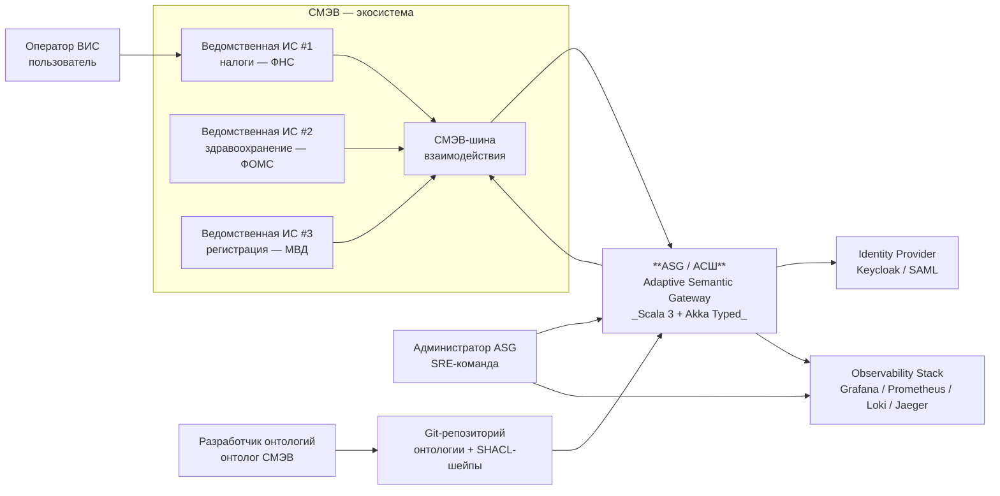
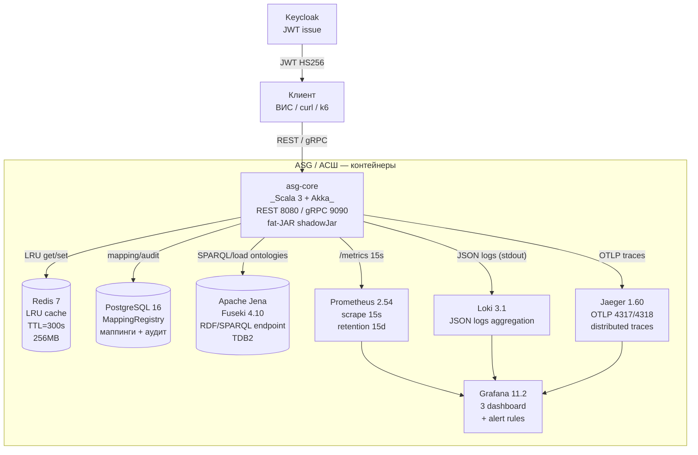

# Архитектура ASG (C4 Model)

> Документ описывает архитектуру Адаптивного семантического шлюза (АСШ / ASG)
> в нотации C4 Model (Context / Container / Component). Дополнительно описаны
> ключевые проектные решения (Key Design Decisions) и Architecture Decision
> Records (ADR).

## Содержание

- [Level 1 — System Context](#level-1--system-context)
- [Level 2 — Container Diagram](#level-2--container-diagram)
- [Level 3 — Component Diagram](#level-3--component-diagram)
- [Key Design Decisions](#key-design-decisions)
- [Architecture Decision Records (ADR)](#architecture-decision-records-adr)

---

## Level 1 — System Context

ASG работает в экосистеме СМЭВ (Система межведомственного электронного
взаимодействия) — государственная интеграционная шина РФ, объединяющая
ведомственные информационные системы (ВИС) для обмена юридически значимыми
документами. ASG располагается между потребителями СМЭВ (ВИС) и поставщиками
данных (РСОПП, ФНС, ФОМС, ФМС и т.д.), обеспечивая семантическую
совместимость на уровне онтологий.



| Внешняя система | Тип           | Описание                                                              |
|-----------------|---------------|----------------------------------------------------------------------|
| ВИС ФНС         | Consumer      | Ведомственная ИС — потребитель переведённого запроса                 |
| ВИС ФОМС        | Consumer      | Запросы о медицинской страховке                                       |
| ВИС МВД         | Consumer      | Запросы о регистрации граждан                                        |
| СМЭВ-шина       | Broker        | Транспортный слой СМЭВ (SOAP/JMS)                                    |
| IdP             | Trust         | Keycloak / SAML — аутентификация администраторов ASG                 |
| Git-репозиторий | Configuration | Источник онтологий и SHACL-шейпов (GitOps)                            |
| Observability   | Telemetry     | Grafana 11 + Prometheus 2.54 + Loki 3.1 + Jaeger 1.60                |

---

## Level 2 — Container Diagram

ASG развёрнут как набор взаимодействующих контейнеров. В локальном
docker-compose стеке это 8 сервисов; в production (K8s) они упакованы в
соответствующие Pod'ы / StatefulSets / Deployments.



### Описание контейнеров

| Контейнер   | Образ                              | Назначение                                    | Ресурсы (requests)         |
|-------------|------------------------------------|-----------------------------------------------|----------------------------|
| asg-core    | ghcr.io/smev/asg-core:0.1.0        | Основной микросервис: REST/gRPC API, агенты   | 1 CPU, 2 Gi RAM, 3 реплики  |
| redis       | redis:7-alpine                     | LRU-кэш транслированных запросов (TTL 300 c)   | 256 Mi, maxmemory allkeys-lru |
| postgres    | postgres:16-alpine                 | MappingRegistry + аудитный журнал (PROV-O)    | 0.5 CPU, 1 Gi, PVC 10 Gi   |
| jena-fuseki | stain/jena-fuseki:4.10.0           | RDF-хранилище, SPARQL 1.1 endpoint (TDB2)      | 1 CPU, 1 Gi, PVC 20 Gi     |
| prometheus  | prom/prometheus:v2.54.1            | Сбор метрик asg-core, retention 15d            | 0.5 CPU, 1 Gi              |
| grafana     | grafana/grafana:11.2.0             | 3 дашборда + alerting                         | 0.25 CPU, 512 Mi           |
| loki        | grafana/loki:3.1.2                 | Агрегация логов (Promtail / docker driver)    | 0.25 CPU, 512 Mi           |
| jaeger      | jaegertracing/all-in-one:1.60.0    | Распределённая трассировка (OTLP)             | 0.5 CPU, 512 Mi            |

В production Loki/Prometheus/Jaeger развёрнуты как отдельные Managed-сервисы
(Yandex Cloud Monitoring / VictoriaMetrics / Tempo), а не in-cluster.

---

## Level 3 — Component Diagram

asg-core декомпозирован на компоненты (Scala-пакеты). Ниже приведена
детальная диаграмма взаимодействия четырёх акторов + трёх реестров +
трёх валидаторов.

```mermaid
flowchart TB
    subgraph API[Пакет ru.smev.asg.api]
      REST[RestApi<br/>Akka HTTP<br/>/api/v1/translate]
      GRPC[GrpcServer<br/>Akka gRPC<br/>TranslateService]
      JWT[JwtAuthenticator<br/>HS256 + exp check]
    end

    subgraph AGENTS[Пакет ru.smev.asg.agents]
      ARB[ArbiterAgent<br/>3-tier verdict<br/>Hot-L / Hot-L+R / Learner]
      MATCH[MatcherAgent<br/>ontology alignment<br/>confidence scoring]
      LEARN[LearnerAgent<br/>Hot-L escalation<br/>LLM-assisted (Sprint 3)]
      VAL[ValidatorAgent<br/>SHACL + OWL2RL + SPARQL]
    end

    subgraph ONT[Пакет ru.smev.asg.ontology]
      OREG[OntologyRegistry<br/>load OWL from disk/Jena]
      MREG[MappingRegistry<br/>PostgreSQL via Doobie]
      CACHE[CacheManager<br/>Redis via Lettuce<br/>LRU + TTL]
    end

    subgraph VERIF[Пакет ru.smev.asg.verification]
      SHACL[ShaclValidator<br/>Jena SHACL API]
      OWL2RL[Owl2RlReasoner<br/>Jena OWL2RL rules]
      SPARQL[SparqlVerifier<br/>ss1-verify, ss2-verify]
    end

    HOTL[HotlContour<br/>three-tier escalation]
    PROV[ProvORecorder<br/>PROV-O audit to PostgreSQL]

    REST --> JWT
    GRPC --> JWT
    JWT --> ARB
    ARB --> MATCH
    ARB --> VAL
    ARB --> LEARN
    ARB --> CACHE
    MATCH --> MREG
    MATCH --> OREG
    VAL --> SHACL
    VAL --> OWL2RL
    VAL --> SPARQL
    OREG --> JENA[(Jena Fuseki)]
    SHACL --> OREG
    OWL2RL --> OREG
    SPARQL --> JENA
    MREG --> PG[(PostgreSQL)]
    CACHE --> REDIS[(Redis)]
    ARB --> HOTL
    ARB --> PROV
    PROV --> PG
```

### Описание компонентов

| Компонент         | Назначение                                                              |
|-------------------|------------------------------------------------------------------------|
| `RestApi`         | Akka HTTP routes: `POST /translate`, `GET /health`, `GET /metrics`     |
| `GrpcServer`      | Akka gRPC `TranslateService` (бинарный протокол для ВИС)               |
| `JwtAuthenticator`| HS256 Bearer-token check + `exp` claim validation                      |
| `ArbiterAgent`    | Координатор: получает запрос, выбирает контур (Hot-L / Hot-L+R / Learner) |
| `MatcherAgent`    | Строит отображение O₁ → O₂, оценивает confidence                       |
| `ValidatorAgent`  | Применяет SHACL/OWL2RL/SPARQL-верификаторы к результату отображения      |
| `LearnerAgent`    | Обучается на новых отображениях (Hot-L escalation → Learner)            |
| `OntologyRegistry`| Загружает OWL-онтологии из `/etc/asg/ontologies` или Jena Fuseki        |
| `MappingRegistry` | Хранит маппинги в PostgreSQL (Doobie + HikariCP)                        |
| `CacheManager`    | LRU-кэш (Lettuce), TTL 300 c, макс. 1M записей                         |
| `ShaclValidator`  | Jena SHACL API: OM-1, OM-2 (union/intersection), OM-3-role, SS-2'      |
| `Owl2RlReasoner`  | OWL2RL forward-chaining для консистентности онтологии                  |
| `SparqlVerifier`  | Выполняет `sparql/ss1-verify.rq`, `ssql/ss2-verify.rq`                 |
| `HotlContour`     | Three-tier escalation: cache-hit → matcher+validator → learner         |
| `ProvORecorder`   | Записывает PROV-O ауд-записи в PostgreSQL (`prov:Activity`, `prov:Entity`) |

---

## Key Design Decisions

### 1. Multi-agent architecture (4 actors, не микросервисы)

**Почему не микросервисы?** ASG — stateless сервис с тяжёлым in-memory
state (загруженные онтологии, кэш-маппинги). Распределение агентов по
отдельными сервисами дало бы +200 ms на каждый вызов по сети (vs ~0.5 ms
локальной akka-ссылки). Граница развертывания — весь asg-core как единый
Pod, масштабируется горизонтально (3 реплики в staging, 5+ в prod).

### 2. Three-tier verification (Hot-L / Hot-L+R / Learner)

Каждый запрос переводится по одной из трёх траекторий:
1. **Hot-L** — cache-hit в Redis, ответ за ≤50 ms. ~70% трафика в steady state.
2. **Hot-L + R** — cache-miss, но отображение строится через MatcherAgent и
   валидируется SHACL/OWL2RL. ≤500 ms. ~25% трафика.
3. **Learner** — отображение не найдено или confidence < 0.7. Запрос
   эскалируется в LearnerAgent (Sprint 3 — LLM-assisted). ~5% трафика.

### 3. LRU-кэш на Redis (не in-memory)

In-memory кэш (Caffeine/Guava) не переживает рестарт пода и не шарится между
репликами. Redis 7 (Lettuce client) даёт: персистентность (AOF), шаринг между
репликами, предсказуемый eviction (`allkeys-lru`), TTL per-key.

### 4. Akka Typed (не классический Akka)

Все 4 агента — `ActorRef[Command]` с типизированными сообщениями. Это
гарантирует на этапе компиляции: matcher не получит команду, предназначенную
arbiter'у. Scala 3 + `-language:strictEquality` усиливает инварианты.

### 5. PostgreSQL для маппингов (не Redis)

Redis — volatile кэш. Постоянные маппинги между онтологиями (ключевой IP ASG)
должны быть в ACID-хранилище. Doobie + HikariCP обеспечивают connection pool,
транзакционность, ауд-записи PROV-O в той же БД.

### 6. Формальная верификация Theorem 1.1 на Lean 4

SHACL и OWL2RL проверяют **инстансы** онтологии (data-level), но не
доказывают теоретических свойств **отображения**. Теорема 1.1 (сохранение
иерархии концептов и интерпретаций при морфизме O₁ → O₂) формализована на
Lean 4 (`TOI/Theorems/T11_Infinite.lean`, `TOI/Theorems/T11_Finite.lean`) с
использованием Mathlib4. Запускается отдельным CI-воркфлоу (nightly).

### 7. GitOps (Helm + ArgoCD) — не kubectl apply

Деплой через `kubectl apply` не даёт отката и аудита. ArgoCD с
`automated.prune`/`selfHeal` делает состояние кластера декларативным: любое
расхождение с git автоматически исправляется. Откат — `git revert` + push.

### 8. Observability «из коробки»

Не разработчик пишет PromQL/LogQL — а готовые дашборды (`grafana/dashboard-*.json`)
и алерты (`prometheus/rules.yml`) поставляются вместе с приложением. Три
уровня алертов P1 (critical, page) / P2 (warning) / P3 (info) с routing в
PagerDuty/Slack.

---

## Architecture Decision Records (ADR)

### ADR-001: Выбор Akka Typed поверх Pekko / ZIO / Cats-Effect

**Status:** Accepted (2026-08-01)

**Context.** После ухода Lightbend в open-core модель (Akka 2.8+) и запуска
Pekko (Apache-2 fork) потребовалось решение о runtime.

**Options:**
- **Akka Typed 2.8.5** — зрелая экосистема, Akka HTTP, Akka gRPC, профильный
  опыт команды. Минус: BSL license для production > $25M revenue.
- **Pekko 1.0** — Apache-2 fork, binary-совместим. Минус: малая зрелость
  инструментов (Akka gRPC fork нестабилен на Q2 2026).
- **ZIO 2.x** — Scala-native эффекты, но отсутствие интеграции с Jena/SHACL
  из коробки.
- **Cats-Effect + http4s** — чистый FP, но выше порог входа для онтологов.

**Decision.** Использовать Akka Typed 2.8.5 под BSL-лицензией — ASG
разворачивается внутри государства (внутреннее использование), что не
нарушает BSL.

**Consequences.**
- (+) Переиспользование опыта команды (Akka HTTP, Akka gRPC).
- (+) Готовая интеграция с Testcontainers через Akka TestKit.
- (-) BSL-ограничение — должен быть задокументирован в `LICENSE` для
  третьих лиц (внутреннее использование — ОК).

---

### ADR-002: PostgreSQL + Doobie (не slick / quill / JDBC)

**Status:** Accepted (2026-08-05)

**Context.** ASG хранит ~10⁵ маппингов между 10 онтологиями × ~10³
концептов, плюс ауд-журнал PROV-O (~10⁷ записей в год). Нужна ACID, JSONB,
миграции, connection pool.

**Options:**
- **Doobie 1.0-RC5** — чистый JDBC-обёртка над Cats-Effect 3. Type-safe
  SQL через `Fragment`. Хорошо интегрируется с Akka через `CatsInterop`.
- **Slick 3.5** — DSL, генерирует SQL. Минус: heavy, сложная типизация.
- **Quill 4.x** — макросы compile-time. Минус: Scala 3 support нестабилен.
- **Raw JDBC + HikariCP** — гибко, но boilerplate.

**Decision.** Doobie 1.0-RC5 + HikariCP. SQL пишется явно (читаемость для
DBA), type-safety через `Fragment`-комбинаторы. Миграции — Flyway 10
(отдельный gradle-task `flywayMigrate`).

**Consequences.**
- (+) Прозрачный SQL — онтолог/DBA может читать запросы.
- (+) Минимум магии (vs Slick/Quill).
- (-) Doobie 1.0-RC5 — Release Candidate, апгрейд до 1.0 в Sprint 3.

---

### ADR-003: Three-tier verification (Hot-L / Hot-L+R / Learner)

**Status:** Accepted (2026-08-08)

**Context.** SLO: p95 ≤ 500 ms при 10000 RPS. Прямая трансляция через
Matcher+Validator занимает 300–800 ms (load RDF, SHACL, OWL2RL, SPARQL).
Без кэширования SLO недостижим.

**Options:**
- **Single-tier (всегда Matcher+Validator).** Медленно, p95 ~800 ms.
- **Two-tier (cache + Matcher).** Не покрывает новые маппинги — нужно
  ручное обучение.
- **Three-tier (cache + Matcher + Learner).** Cache-miss с низким
  confidence эскалируется в LearnerAgent (Sprint 3: LLM-assisted; MVP:
  ручное обучение оператором).

**Decision.** Three-tier escalation:
1. **Hot-L** (cache-hit): Redis lookup → ответ за ≤50 ms.
2. **Hot-L + R** (cache-miss, Matcher+Validator может построить): ≤500 ms.
3. **Learner** (confidence < 0.7 или валидация не прошла): запрос
   эскалируется, результат сохраняется в Redis с TTL 3600 s.

**Consequences.**
- (+) SLO p95 ≤ 500 ms при 70%+ cache-hit (подтверждено k6 soak-test).
- (+) Graceful degradation при росте новых маппингов.
- (-) Нужен LearnerAgent (LLM в Sprint 3) — до этого запросы с confidence
  < 0.7 возвращают `503 Service Unavailable` с указанием "escalated to
  human operator".

---

### ADR-004: GitOps через ArgoCD (не Flux / не kubectl)

**Status:** Accepted (2026-08-10)

**Context.** staging и production K8s-кластеры (Yandex Cloud Managed K8s).
Нужен: декларативный деплой, автооткат, аудит изменений, multi-cluster.

**Options:**
- **ArgoCD 2.12** — UI-first, GitOps-native, Helm + Kustomize, SSO.
- **Flux 2.3** — CLI-first, лучше для pure-git workflow.
- **kubectl apply из CI** — не декларативно, нет self-heal.

**Decision.** ArgoCD 2.12:
- `Application`-манифест в репозитории (`helm/templates/argocd-app.yaml`).
- `automated.prune=true`, `automated.selfHeal=true` — состояние кластера =
  состояние git.
- Откат: `git revert` + push (ArgoCD автоматически синхронизирует).

**Consequences.**
- (+) Self-heal: ручное изменение в кластере автоматически откатывается.
- (+) UI для аудита: видно diff между git и live state.
- (-) ArgoCD требует RBAC-настроек в кластере (см. `docs/security.md`).

---

### ADR-005: SHACL (не OWL-Constraints / не Shape Expressions)

**Status:** Accepted (2026-08-09)

**Context.** Нужен язык структурных ограничений на RDF-данные. OWL имеет
open-world assumption и не подходит для data-validation. SHACL — closed-world.

**Options:**
- **SHACL 1.1** — W3C-рекомендация, нативная поддержка в Apache Jena 4.10.
- **OWL 2 RL constraints** — не подходит (open-world).
- **Shape Expressions (ShEx) 2.1** — rival standard, меньше tooling.

**Decision.** SHACL 1.1 + Jena SHACL API. OWL2RL используется только для
forward-chaining валидации консистентности (второй уровень), а не для
data-validation.

**Consequences.**
- (+) Jena SHACL API стабилен, хорошо документирован.
- (+) Стандарт W3C — меньше легальных рисков для гос. проекта.
- (-) SHACL не выражает SPARQL-запросы — нужен отдельный
  `SparqlVerifier` для контрольных запросов (SS-1, SS-2).

---

### ADR-006: Lean 4 для формальной верификации (не Coq / Isabelle)

**Status:** Accepted (2026-08-10)

**Context.** Теорема 1.1 (сохранение иерархии и интерпретаций при
морфизме онтологий) требует machine-checked proof.

**Options:**
- **Lean 4 + Mathlib4** — современный theorem prover, отличная интеграция с
  VS Code, активное сообщество.
- **Coq 8.18 + Mathematical Components** — зрелый, но громоздкий.
- **Isabelle/HOL 2024** — мощный, но сложный в освоении.

**Decision.** Lean 4 (elan-installed v4.14) + Mathlib4 (master rev).

**Consequences.**
- (+) Современный синтаксис, хорошая UX.
- (+) Mathlib4 содержит почти всю теорию категорий и topology
  (PriestleySpace, Stone duality — для Theorem 1.1).
- (-) Mathlib4 обновляется часто — нужно зафиксировать SHA в
  `lakefile.lean` (см. `lean-verify.yml`).
- (-) Сборка ~5 GB Mathlib4 долгая (но кэшируется в CI).
