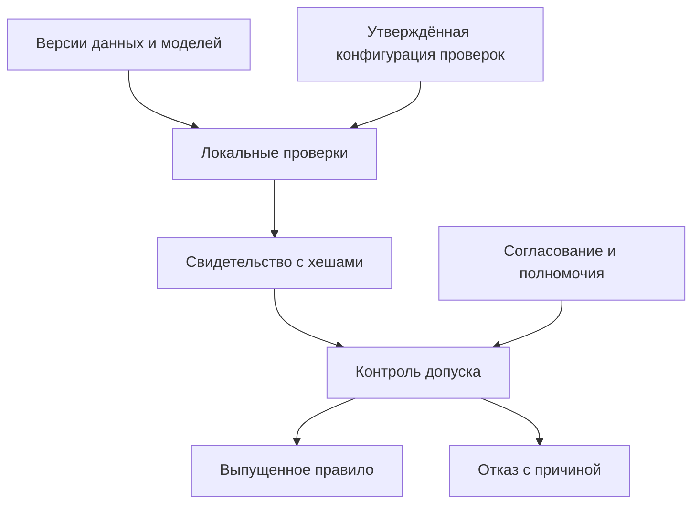

# Архитектура и эталонная модель

## Соответствие ГОСТ Р 55062—2021

[Карточка Росстандарта](https://protect.gost.ru/gost/details/72935e67-fb1c-49d0-8a5e-af66fb7ba1c5)
идентифицирует базовый стандарт. В проекте принята его модель:

| Уровень | Предмет | Артефакт данного репозитория |
|---|---|---|
| Технический | Форматы, передача, интерфейсы, обработка ошибок | CLI, Turtle, явные коды завершения; транспортный сервис не реализован |
| Семантический | Согласованное значение и использование информации | Формальные модели, формы, метаданные, конечные переводы |
| Организационный | Цель, роли, полномочия, ответственность и процессы | Модель выпуска и её контекст, порядок изменений |

Профиль интероперабельности понимается как согласованный набор стандартов.
`ReleaseContext` — технический объект, связывающий его идентификатор/версию
с конкретными данными, операцией и свидетельствами; он не переопределяет
нормативное понятие профиля. Безопасность, наблюдаемость и эксплуатация
охватывают все три уровня.

## Исполняемый контур

CLI реализует путь до свидетельства. Контроль допуска реализован библиотечной
функцией и тестируется отдельно. Исполнение произвольного предметного правила,
приём сетевых сообщений и связь с действующей СМЭВ здесь не реализованы.

## Проектное развитие

Федерация сохраняет полномочия и первичные данные у участников. Реестры
соответствий должны ссылаться на версии источников, а не создавать
неуправляемые копии. Озеро данных допустимо как отдельное архитектурное
решение при установленном назначении, сроках и правах доступа.

ИИ-агент может предлагать соответствия и пояснения. Проверка, согласование,
выпуск и исполнение образуют разные функции. Оркестрация отвечает за порядок
работы и обработку отказов; она не является доказательством корректности
решений агентов. Обучение по эксплуатационным данным не меняет выпущенное
правило без повторного допуска. Уверенность модели не заменяет свидетельство.

Федеративные системы, системы систем, автономные группировки и рои требуют
дополнительных контрактов времени, состава участников и безопасного режима.
Булева теорема не доказывает устойчивость управления или безопасность роя.
Протоколы MQTT, Matter, MAVLink и сетевые топологии могут быть включены в
конкретные технические профили, но сами по себе не обеспечивают семантическую
и организационную интероперабельность.
