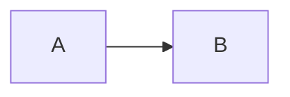

# Архитектурные диаграммы ASG

Данный каталог содержит векторные архитектурные диаграммы проекта
**ASG (Architectural Semantic Gateway)** — семантического шлюза для
системы межведомственного электронного взаимодействия (СМЭВ).

Все диаграммы написаны на языке **Mermaid** (Markdown-расширение),
который GitHub рендерит автоматически. При необходимости диаграммы
могут быть экспортированы в SVG/PNG через `mermaid-cli`.

## Состав каталога

| № | Файл | Тип диаграммы | Уровень C4 / назначение |
|---|------|---------------|--------------------------|
| 1 | `c4-level1-system-context.md` | `graph LR` | C4 Level 1 — системный контекст |
| 2 | `c4-level2-container.md` | `graph TB` | C4 Level 2 — контейнеры (deployable units) |
| 3 | `c4-level3-component.md` | `graph TB` | C4 Level 3 — компоненты (agents, registries, verifiers) |
| 4 | `asg-fsm-s0-s3.md` | `stateDiagram-v2` | Конечный автомат ASG: S0→S1→S2→S3 |
| 5 | `three-tier-verification.md` | `flowchart TD` | Трёхуровневая верификация отображений |
| 6 | `ci-cd-pipeline.md` | `flowchart TD` | Конвейер CI/CD (6 стадий) |
| 7 | `lean4-theorem-dependencies.md` | `graph TD` | Граф зависимостей теорем Lean 4 (TOI) |

## Принципы оформления

- Каждая диаграмма сопровождается: кратким описанием, блоком кода
  ```` ```mermaid ````, пояснением и легендой.
- Используется нотация C4 (Person / System / Container / Component) с
  русскими наименованиями и английскими идентификаторами узлов.
- Цветовая палитра соответствует стандартной схеме C4:
  - синий — внешние системы (СМЭВ, ФНС, МВД, ЕГИСЗ);
  - зелёный — ASG (внутренний);
  - серый — инфраструктура (Redis, PostgreSQL, Jaeger);
  - оранжевый — операторы (человек).
- Все дуги подписаны семантическими метками протоколов
  (gRPC, REST, JDBC, SPARQL, HTTP/JSON).

## Рендеринг Mermaid на GitHub

GitHub автоматически рендерит блоки ```` ```mermaid ```` в файлах
`.md`. Дополнительных настроек не требуется. Пример:

````markdown

````

На странице GitHub (включая превью Pull Request) будет отображён
готовый векторный SVG.

## Экспорт в SVG / PNG через `mermaid-cli`

Для локального рендеринга и сохранения векторной графики (например,
для публикации в отчётах, не поддерживающих Mermaid) используйте
[`@mermaid-js/mermaid-cli`](https://github.com/mermaid-js/mermaid-cli):

### Установка

```bash
# через npm
npm install -g @mermaid-js/mermaid-cli

# или через npx (без глобальной установки)
npx -p @mermaid-js/mermaid-cli mmdc --version
```

### Извлечение блоков Mermaid из Markdown

`mmdc` принимает на вход `.mmd`-файл, поэтому сначала извлечём
блок кода Mermaid из Markdown-файла:

```bash
# Извлечь первый блок ```mermaid``` из диаграммы в файл .mmd
awk '/```mermaid/{flag=1;next}/```/{if(flag){flag=0;exit}}flag' \
  c4-level1-system-context.md > _tmp.mmd
```

### Рендеринг в SVG и PNG

```bash
# SVG (векторный формат, рекомендуется для отчётов и презентаций)
mmdc -i _tmp.mmd -o c4-level1-system-context.svg

# PNG (растровый, для эскизов)
mmdc -i _tmp.mmd -o c4-level1-system-context.png -w 1600 -H 1200

# PDF (для печати)
mmdc -i _tmp.mmd -o c4-level1-system-context.pdf
```

### Пакетный экспорт всех диаграмм

```bash
#!/usr/bin/env bash
# scripts/export-diagrams.sh — экспорт всех диаграмм в SVG
set -euo pipefail
cd "$(dirname "$0")/../docs/diagrams"

for md in *.md; do
  [[ "$md" == "README.md" ]] && continue
  name="${md%.md}"
  awk '/```mermaid/{flag=1;next}/```/{if(flag){flag=0;exit}}flag' \
    "$md" > "_${name}.mmd"
  mmdc -i "_${name}.mmd" -o "${name}.svg" -b transparent
  rm -f "_${name}.mmd"
done

echo "Все диаграммы экспортированы в SVG."
```

### Рекомендации по качеству

- Используйте флаг `-b transparent` для SVG, чтобы диаграммы
  интегрировались в светлые/тёмные темы.
- Задавайте явную тему: `mmdc -i in.mmd -o out.svg -t dark` (или `-t`/`default`/`forest`).
- Для сложных C4-диаграмм задавайте `-w 2400` для сохранения читаемости.

## Использование в LaTeX / PDF-отчётах

SVG-файлы, полученные через `mmdc`, могут быть встроены в LaTeX через
пакет `svg` или сконвертированы в PDF через `rsvg-convert`:

```bash
rsvg-convert -f pdf -o c4-level1.pdf c4-level1.svg
```

Затем в `.tex`:

```latex
\includegraphics[width=\textwidth]{c4-level1.pdf}
```

## Версионирование

Диаграммы версионируются вместе с кодом (см. `CHANGELOG.md`).
При значимом изменении архитектуры (например, добавление нового
агента) обновляйте все соответствующие C4-уровни одновременно и
добавляйте запись в `CHANGELOG.md` в секцию *Changed*.

## Связанные документы

- [docs/architecture.md](../architecture.md) — словесное описание архитектуры
- [docs/verification-guide.md](../verification-guide.md) — руководство по верификации
- [docs/deployment.md](../deployment.md) — схема развертывания
- [docs/monitoring.md](../monitoring.md) — наблюдаемость

## Лицензия

Диаграммы распространяются под той же лицензией, что и репозиторий
(см. корневой `LICENSE`).
