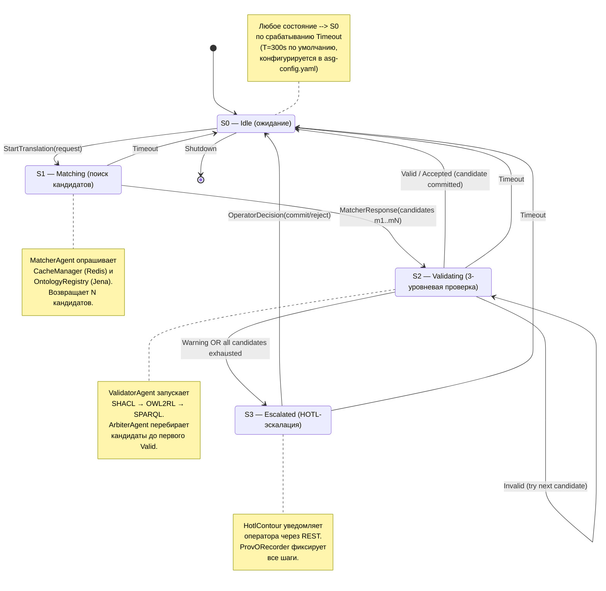

# Конечный автомат ASG: S0 → S1 → S2 → S3

## Назначение

Диаграмма показывает конечный автомат (FSM) обработки
межведомственного запроса в ASG. Состояния соответствуют этапам
жизненного цикла: ожидание → matching → верификация → эскалация
HOTL. Автомат реализован в `ArbiterAgent` (см.
[`asg-core/src/main/scala/ru/smev/asg/agents/ArbiterAgent.scala`](../../asg-core/src/main/scala/ru/smev/asg/agents/ArbiterAgent.scala)).

## Диаграмма

## Описание состояний

### S0 — Idle

- **Вход**: инициализация `ArbiterAgent` при старте или завершение
  предыдущего цикла.
- **Действие**: ожидание сообщения `StartTranslation(request)`.
- **Таймаут**: нет (состояние покоя).

### S1 — Matching

- **Вход**: `StartTranslation`.
- **Действие**: `MatcherAgent` опрашивает `CacheManager` (Redis),
  при miss — `OntologyRegistry` (Jena SPARQL), формирует список
  кандидатов `m1..mN` (N ≤ 5).
- **Выход**: `MatcherResponse(candidates)` → S2.
- **Таймаут**: 60s (если `MatcherAgent` не ответил, → S0 с ошибкой).

### S2 — Validating

- **Вход**: `MatcherResponse`.
- **Действие**: `ValidatorAgent` запускает трёхуровневую верификацию
  (см. [`three-tier-verification.md`](./three-tier-verification.md)).
- **Возможные переходы**:
  - `Valid` → S0 (кандидат коммитится в `MappingRegistry`).
  - `Invalid` → остаются ещё кандидаты? Если да, повторно S2
    со следующим кандидатом.
  - `Warning` → S3 (эскалация).
  - Все кандидаты исчерпаны → S3.
- **Таймаут**: 120s.

### S3 — Escalated (HOTL)

- **Вход**: `Warning` или исчерпание кандидатов.
- **Действие**: `HotlContour` уведомляет оператора (REST-вебхук +
  polling-конечная точка); `ProvORecorder` пишет PROV-O тройки.
- **Выход**: `OperatorDecision(commit|reject)` → S0.
- **Таймаут**: 24h (если оператор не ответил, запрос закрывается
  со статусом `Rejected` и записью в `audit_log`).

## Глобальный таймаут

Время жизни запроса ограничено `T=300s` (настраивается в
`asg-config.yaml` → `asg.request.timeout`). При срабатывании
глобального таймаута текущее состояние завершается с
`ProvORecorder.audit` и автомат возвращается в S0.

## Связанные документы

- Исходный код FSM: [`../../asg-core/src/main/scala/ru/smev/asg/agents/ArbiterAgent.scala`](../../asg-core/src/main/scala/ru/smev/asg/agents/ArbiterAgent.scala)
- Структура верификации: [`three-tier-verification.md`](./three-tier-verification.md)
- HOTL-контур: [`../../asg-core/src/main/scala/ru/smev/asg/hotl/HotlContour.scala`](../../asg-core/src/main/scala/ru/smev/asg/hotl/HotlContour.scala)
- Компонентная диаграмма: [`c4-level3-component.md`](./c4-level3-component.md)

## Легенда

| Состояние | Цвет (в рендере) | Семантика                          |
|-----------|------------------|-------------------------------------|
| S0        | зелёный          |_idle, завершён                     |
| S1        | синий            | активный поиск                      |
| S2        | жёлтый           | проверка (потенциально долгий)     |
| S3        | красный          | требует вмешательства человека     |
