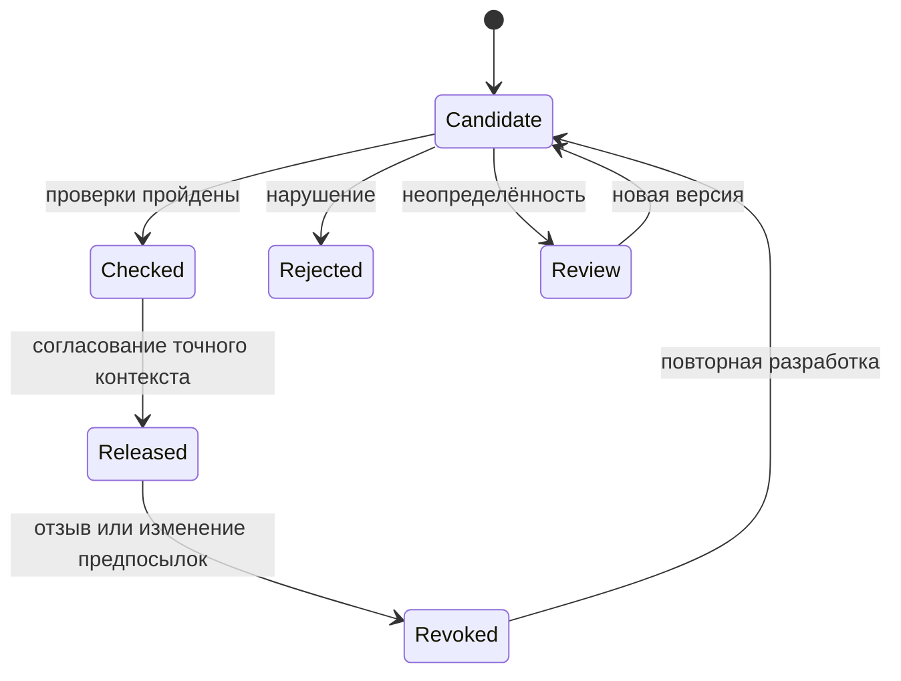

# Проектный жизненный цикл правила

`ReleaseGate` реализует условия перехода к допущенному объекту и его повторной
проверки на применимость. Персистентный автомат, очередь согласования и
распределённое исполнение остаются проектным развитием.
