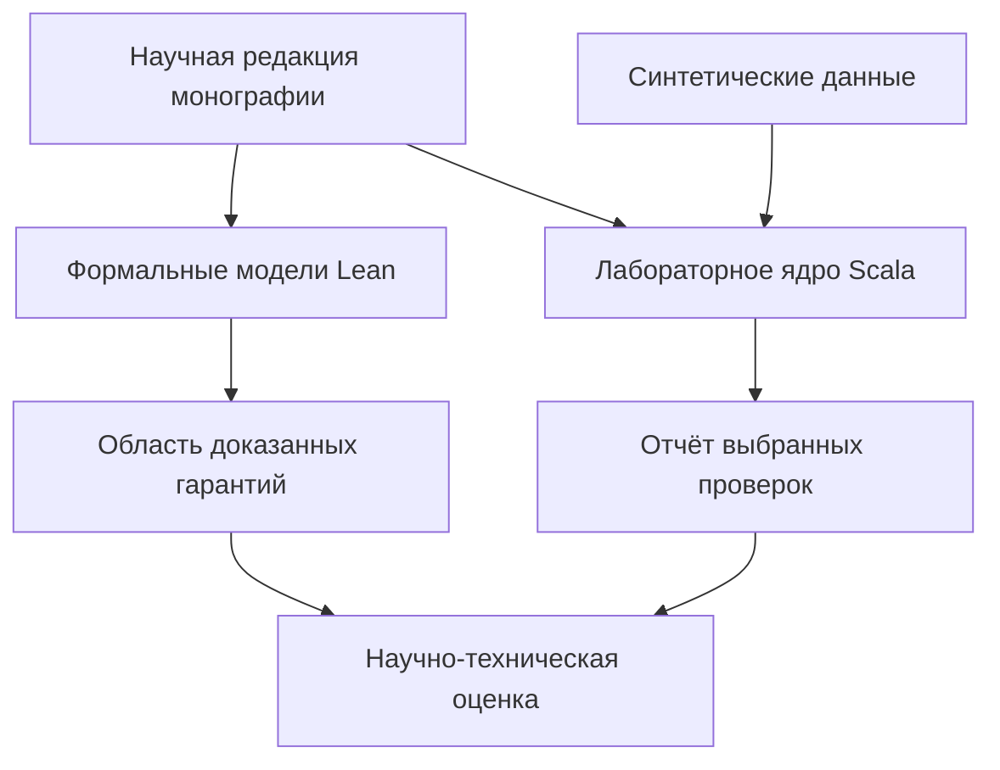

# Контекст лаборатории

```mermaid
flowchart TB
  M["Научная редакция монографии"] --> F["Формальные модели Lean"]
  M --> L["Лабораторное ядро Scala"]
  D["Синтетические данные"] --> L
  F --> R["Область доказанных гарантий"]
  L --> E["Отчёт выбранных проверок"]
  R --> A["Научно-техническая оценка"]
  E --> A
```

Связи с ведомственными системами не изображаются как реализованные.
