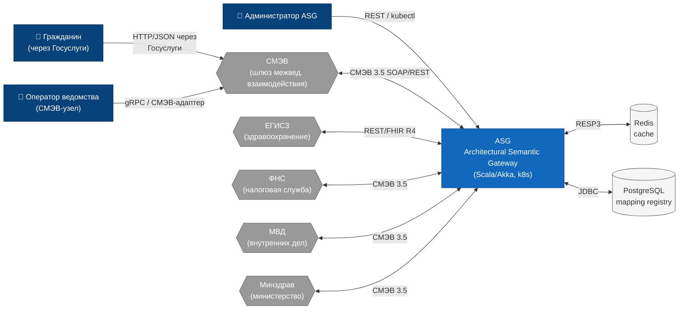

# C4 Level 1 — Системный контекст ASG

## Назначение

Диаграмма **System Context** (C4 Level 1) показывает ASG как
единый чёрный ящик во взаимодействии с внешними системами
СМЭВ-экосистемы и конечными пользователями. На этом уровне
скрываются все внутренние детали (контейнеры, компоненты) и
демонстрируется только то, что важно для нетехнических
заинтересованных сторон: какие организации и системы взаимодействуют
с ASG и по каким каналам.

## Диаграмма

## Пояснение

### Актёры (внешние люди)

- **Гражданин** — физическое лицо, инициирующее запрос через
  портал Госуслуг. Не взаимодействует с ASG напрямую, только через
  СМЭВ.
- **Оператор ведомства** — сотрудник ведомственного узла СМЭВ,
  отправляющий межведомственные запросы и принимающий результаты.
- **Администратор ASG** — эксплуатирующий инженер, выполняющий
  настройку (онкологии, шейпы, пороги), мониторинг и ротацию JWT.

### Внешние системы (участники СМЭВ-экосистемы)

- **СМЭВ** — система межведомственного электронного взаимодействия
  (основной транспорт, SOAP/REST 3.5).
- **ЕГИСЗ** — Единая государственная информационная система
  здравоохранения (FHIR R4).
- **ФНС** — Федеральная налоговая служба.
- **МВД** — Министерство внутренних дел.
- **Минздрав** — Министерство здравоохранения РФ.

### Свойства ASG (на этом уровне)

- **Язык/стек**: Scala 3 + Akka Typed + cats-effect.
- **Развёртывание**: Kubernetes (StatefulSet, 3 реплики).
- **Протоколы**: gRPC для ведомств, REST/OpenAPI 3 для операторов.
- **Хранилища**: Redis (LRU-кэш кандидатов отображений),
  PostgreSQL (содержательное хранилище MappingRegistry).

### Граница системы (boundary)

Всё, что попадает в подсветку `asg` (синий), — внутренняя зона
ответственности ASG. Любой обмен с внешними ведомствами
происходит **только** через СМЭВ-адаптеры и контролируется
трёхуровневой верификацией отображений (см.
[`three-tier-verification.md`](./three-tier-verification.md)).

## Связанные диаграммы

- Внутреннее устройство ASG: [`c4-level2-container.md`](./c4-level2-container.md)
- Компоненты внутри ASG-контейнера: [`c4-level3-component.md`](./c4-level3-component.md)
- Цикл обработки запроса: [`asg-fsm-s0-s3.md`](./asg-fsm-s0-s3.md)

## Легенда

| Цвет       | Тип узла                  |
|------------|---------------------------|
| Тёмно-синий | Человек (актёр)           |
| Серый       | Внешняя система / сервис  |
| Синий       | ASG (внутренняя система)  |
| Светло-серый | Хранилище данных         |
