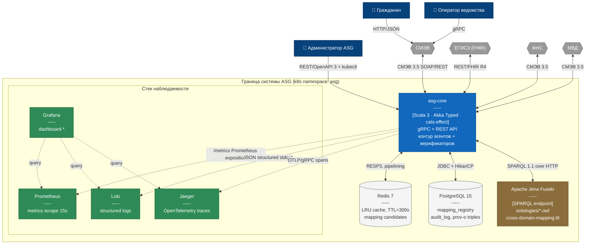

# C4 Level 2 — Контейнеры ASG

## Назначение

Диаграмма **Container** (C4 Level 2) показывает внутреннее устройство
системы ASG на уровне независимо развёртываемых единиц (контейнеров):
основной сервис ASG (Scala/Akka), хранилище онтологий Apache Jena
Fuseki, кэш Redis, базу PostgreSQL, а также стек наблюдаемости
(Prometheus, Grafana, Loki, Jaeger). Внешние системы (СМЭВ, ЕГИСЗ,
ФНС и т.д.) здесь представлены как контексты — подробно они раскрыты
в [`c4-level1-system-context.md`](./c4-level1-system-context.md).

## Диаграмма

## Описание контейнеров

### 1. `asg-core` — основной сервис ASG

- **Стек**: Scala 3.3, Akka Typed 2.8, cats-effect 3, http4s, grpc-java.
- **Развёртывание**: Kubernetes `StatefulSet`, 3 реплики, anti-affinity.
- **Образ**: `ghcr.io/smev/asg-core:${VERSION}` (см. `asg-core/Dockerfile`).
- **Порты**:
  - `8080/tcp` — REST/OpenAPI 3 (для администраторов и эксплуататоров);
  - `9090/tcp` — gRPC (для ведомств и СМЭВ-адаптера);
  - `9100/tcp` — `/metrics` (Prometheus exposition).
- **Ресурсы**: requests `cpu=500m, mem=1Gi`; limits `cpu=2000m, mem=4Gi`.
- **JVM флаги**: `-XX:+UseZGC -XX:MaxRAMPercentage=75`.

### 2. `Redis 7` — кэш кандидатов отображений

- **Назначение**: LRU-кэш результатов `MatcherAgent`, TTL=300s.
- **Развёртывание**: `StatefulSet` с persistence `appendonly.aof`.
- **Протокол**: RESP3 (pipelining + client-side caching).
- **Структуры**: hash `mappings:{source}:{target}`, set `candidates:{req_id}`.

### 3. `PostgreSQL 15` — хранилище MappingRegistry

- **Назначение**: постоянное хранилище онтологических отображений,
  журнала аудита, Prov-O-троек, конфигурации HOTL-контура.
- **Развёртывание**: `StatefulSet`, primary + read-replica, WAL архивирование.
- **Схемы**: `mapping_registry`, `audit`, `provenance`, `config`.

### 4. `Apache Jena Fuseki` — SPARQL endpoint

- **Назначение**: триплстор онтологий (`ontologies/*.owl`,
  `ontologies/cross-domain-mapping.ttl`), выполняет запросы
  `sparql/ss1-verify.rq` и `sparql/ss2-verify.rq` на уровне 3
  верификации.
- **Развёртывание**: `Deployment`, 1 реплика, persistent volume.
- **Порт**: `3030/tcp` (SPARQL over HTTP).

### 5. Стек наблюдаемости

- **Prometheus** — метрики ASG (15s scrape), alerting через
  `prometheus/rules.yml`.
- **Grafana** — дашборды:
  `dashboard-service.json`, `dashboard-operational.json`,
  `dashboard-business.json`.
- **Loki** — structured logs (JSON), 30 дней retention.
- **Jaeger** — OpenTelemetry distributed tracing, sampling 1% в prod,
  100% в staging.

## Связанные диаграммы

- Внешний контекст: [`c4-level1-system-context.md`](./c4-level1-system-context.md)
- Внутренние компоненты asg-core: [`c4-level3-component.md`](./c4-level3-component.md)
- Развёртывание (Helm/K8s): [`ci-cd-pipeline.md`](./ci-cd-pipeline.md)
- Словесное описание: [`../architecture.md`](../architecture.md)

## Легенда

| Цвет         | Тип контейнера                       |
|--------------|--------------------------------------|
| Синий        | Основной сервис asg-core             |
| Коричневый   | Хранилище онтологий (Jena Fuseki)    |
| Светло-серый | Хранилище данных (Redis, PostgreSQL)|
| Зелёный      | Стек наблюдаемости                   |
| Тёмно-синий  | Человек                              |
| Серый        | Внешняя система                       |
