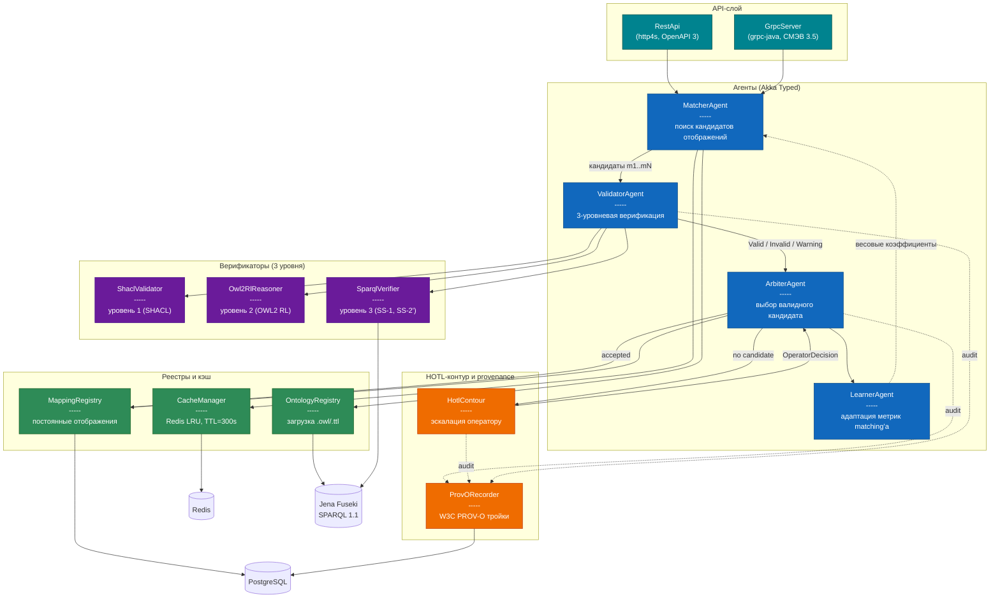

# C4 Level 3 — Компоненты asg-core

## Назначение

Диаграмма **Component** (C4 Level 3) детализирует внутреннее
устройство контейнера `asg-core` до уровня отдельных Scala/Akka
компонентов. Здесь показаны 4 агента (`MatcherAgent`,
`ValidatorAgent`, `ArbiterAgent`, `LearnerAgent`), два реестра
(`OntologyRegistry`, `MappingRegistry`) и менеджер кэша, а также
три верификатора (`ShaclValidator`, `Owl2RlReasoner`,
`SparqlVerifier`) и два вспомогательных компонента HOTL-контура
(`HotlContour`, `ProvORecorder`).

## Диаграмма

## Описание компонентов

### Агенты (Akka Typed)

| Компонент         | Ответственность                                                |
|-------------------|----------------------------------------------------------------|
| `MatcherAgent`    | Поиск N кандидатов отображений по запросу; использует `OntologyRegistry` и кэш `CacheManager` |
| `ValidatorAgent`  | Запуск трёхуровневой верификации (SHACL → OWL2RL → SPARQL); возвращает `Valid`/`Invalid`/`Warning` |
| `ArbiterAgent`    | Перебор кандидатов от `MatcherAgent` до первого `Valid`; при отсутствии — эскалация в HOTL |
| `LearnerAgent`    | Адаптация весов matching'a по результатам `ArbiterAgent` (онлайн-обучение) |

### Реестры и кэш

| Компонент            | Хранилище       | Назначение                              |
|----------------------|-----------------|------------------------------------------|
| `OntologyRegistry`   | Jena Fuseki     | Загрузка `.owl`/`.ttl`, refresh без рестарта |
| `MappingRegistry`    | PostgreSQL      | Постоянные отображения, история версий    |
| `CacheManager`       | Redis           | LRU кандидатов `MatcherAgent`, TTL=300s  |

### Верификаторы (см. [`three-tier-verification.md`](./three-tier-verification.md))

| Компонент         | Уровень | Технология                                    |
|-------------------|---------|------------------------------------------------|
| `ShaclValidator`  | 1       | Apache Jena SHACL, shapes из `shapes/*.ttl`    |
| `Owl2RlReasoner`  | 2       | OWL2 RL profile, pellet-like rules              |
| `SparqlVerifier`  | 3       | SPARQL 1.1, запросы `sparql/ss1-verify.rq`, `sparql/ss2-verify.rq` |

### HOTL-контур и provenance

| Компонент       | Назначение                                                    |
|-----------------|---------------------------------------------------------------|
| `HotlContour`   | Эскалация неоднозначных кандидатов оператору через REST/gRPC; хранение `OperatorDecision` |
| `ProvORecorder` | Запись W3C PROV-O троек в PostgreSQL (схема `provenance`) для аудита |

## Связанные диаграммы

- Жизненный цикл обработки запроса: [`asg-fsm-s0-s3.md`](./asg-fsm-s0-s3.md)
- Детали верификации: [`three-tier-verification.md`](./three-tier-verification.md)
- Внешние контейнеры: [`c4-level2-container.md`](./c4-level2-container.md)
- Исходный код: [`../../asg-core/src/main/scala/ru/smev/asg/`](../../asg-core/src/main/scala/ru/smev/asg/)

## Легенда

| Цвет         | Тип компонента                    |
|--------------|-----------------------------------|
| Синий        | Агент (Akka Typed)               |
| Фиолетовый   | Верификатор                       |
| Зелёный      | Реестр / кэш                       |
| Оранжевый    | HOTL-контур и provenance          |
| Бирюзовый    | API-слой (REST/gRPC)              |
| Серо-синий   | Хранилище (внешний контейнер)     |
