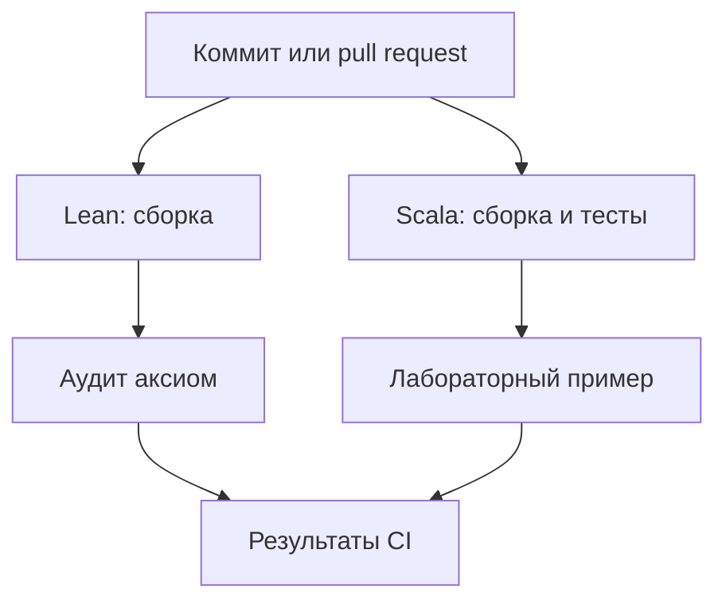

# Непрерывная проверка

```mermaid
flowchart TB
  C["Коммит или pull request"] --> L["Lean: сборка"]
  C --> S["Scala: сборка и тесты"]
  L --> A["Аудит аксиом"]
  S --> E["Лабораторный пример"]
  A --> R["Результаты CI"]
  E --> R
```

Workflow не выполняет развёртывание. Новая ветка и PR позволяют проверить
изменения перед объединением. Положительный CI подтверждает только
перечисленные проверки.
