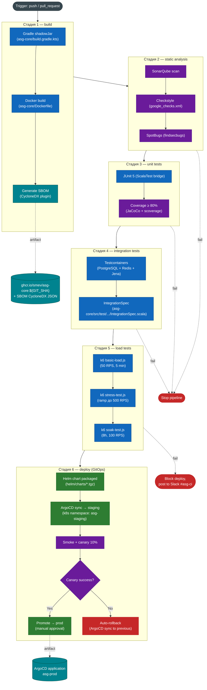

# Конвейер CI/CD ASG

## Назначение

Диаграмма описывает 6-стадийный конвейер непрерывной интеграции и
доставки ASG. Конвейер запускается при `push` в `main`/`develop`
или открытом Pull Request. Управление релизами в staging и prod
осуществляется через GitOps (ArgoCD + Helm). Все артефакты
(Docker-образы, SBOM, SonarQube-отчёты) сохраняются в реестре
`ghcr.io/smev` и Artifactory.

## Диаграмма

## Описание стадий

### Стадия 1 — build

- **Сборка**: `./gradlew :asg-core:shadowJar` (Fat JAR).
- **Docker**: multi-stage build на `eclipse-temurin:21-jre-alpine`.
- **SBOM**: CycloneDX Gradle-плагин, артефакт
  `asg-core/build/reports/bom.json` (формат CycloneDX 1.5).
- **Время**: ~3 мин.
- **Артефакт**: `ghcr.io/smev/asg-core:${GIT_SHA}` + SBOM.

### Стадия 2 — static analysis

- **SonarQube**: quality gate `ASG-Way` (см. `sonar-project.properties`).
- **Checkstyle**: конфиг `google_checks.xml` + кастомные правила
  наименования акторов (`*Agent`, `*Validator`, `*Registry`).
- **SpotBugs**: с плагином `findsecbugs` (security hotspots).
- **Время**: ~2 мин.

### Стадия 3 — unit tests

- **Фреймворк**: ScalaTest + JUnit 5 bridge.
- **Покрытие**: scoverage ≥ 80% (Scala) + JaCoCo ≥ 80% (Java).
- **Проверяемые классы**: `MatcherAgentSpec`, `ValidatorAgentSpec`,
  `ArbiterAgentSpec`, `LearnerAgentSpec`, `ShaclValidatorSpec`,
  `OntologyRegistrySpec`, `RestApiSpec`.
- **Время**: ~4 мин.

### Стадия 4 — integration tests

- **Подход**: Testcontainers (PostgreSQL 15, Redis 7, Jena Fuseki 4.10).
- **Сценарии**: `IntegrationSpec` — полный цикл
  S0→S1→S2→S0 (valid) и S0→S1→S2→S3→S0 (warning/escalation).
- **Время**: ~6 мин.

### Стадия 5 — load tests

- **Инструмент**: k6, скрипты `tests/k6/*.js`.
- **Сценарии**:
  - `basic-load.js` — 50 RPS × 5 мин, p95 < 200ms.
  - `stress-test.js` — ramp до 500 RPS, проверка деградации.
  - `soak-test.js` — 8h × 100 RPS, проверка утечек памяти.
- **Время**: 5 мин (basic+stress), soak — отдельный nightly job.

### Стадия 6 — deploy (GitOps)

- **Подход**: GitOps через ArgoCD, Helm-чарт `helm/`.
- **Staging**: автосинхронизация после успешных стадий 1–5.
- **Canary**: 10% трафика → staging-образ в prod namespace через
  Argo Rollouts.
- **Promote → prod**: ручное approval в ArgoCD (2 пары глаз).
- **Rollback**: автоматический при ошибке canary (ArgoCD sync к
  предыдущей ревизии `helm/Chart.yaml`).

## Связанные файлы

- Конфигурация CI: `.github/workflows/ci.yml` (плагин GitHub Actions).
- Helm-чарт: [`helm/`](../../helm/)
- K8s-манифесты: [`k8s/`](../../k8s/)
- SBOM-политика: [`normative/sbom-policy.md`](../../normative/sbom-policy.md)
- k6 скрипты: [`tests/k6/`](../../tests/k6/)
