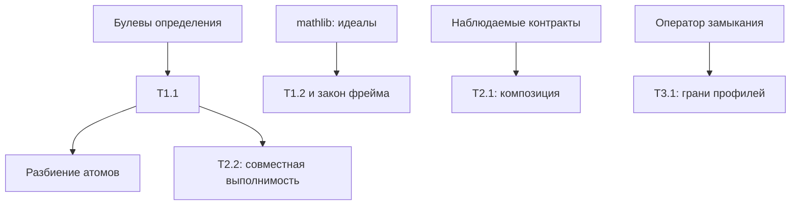

# Зависимости формальных моделей

```mermaid
flowchart TB
  B["Булевы определения"] --> T11["T1.1"]
  T11 --> P["Разбиение атомов"]
  T11 --> T22["T2.2: совместная выполнимость"]
  I["mathlib: идеалы"] --> T12["T1.2 и закон фрейма"]
  O["Наблюдаемые контракты"] --> T21["T2.1: композиция"]
  C["Оператор замыкания"] --> T31["T3.1: грани профилей"]
```

Реляционная семантика и контрпримеры импортируются отдельно.
Полный состав импортов проверяет `scripts/check_repository.py`.
