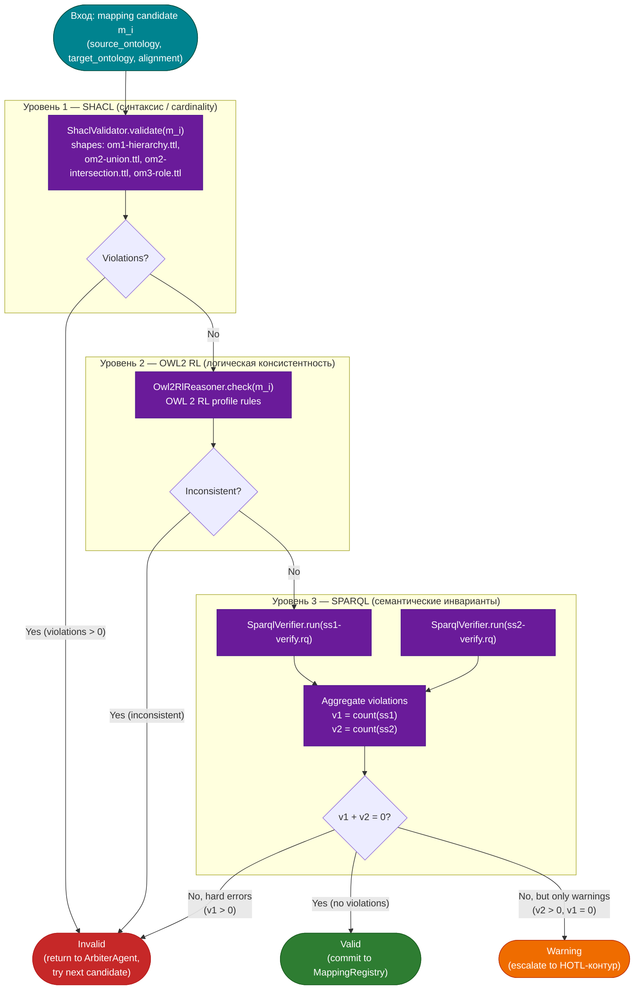

# Трёхуровневая верификация отображений

## Назначение

Flowchart показывает конвейер верификации кандидата отображения в
`ValidatorAgent`. Три уровня проверки строго упорядочены по
возрастанию сложности: ранний выход (early exit) на максимально
дешёвом уровне. Это обеспечивает O(1) отклонение заведомо
непригодных кандидатов и запускает дорогую SPARQL-верификацию
только для уже синтаксически и логически корректных отображений.

## Диаграмма

## Описание уровней

### Уровень 1 — SHACL

- **Компонент**: `ShaclValidator`
  ([`asg-core/.../verification/ShaclValidator.scala`](../../asg-core/src/main/scala/ru/smev/asg/verification/ShaclValidator.scala)).
- **Шейпы**: `shapes/om1-hierarchy.ttl`, `shapes/om2-union.ttl`,
  `shapes/om2-intersection.ttl`, `shapes/om3-role.ttl`.
- **Что проверяет**: кардинальности, типы, обязательные свойства,
  соответствие иерархии классов (OM1), объединению/пересечению (OM2),
  ролям (OM3).
- **Стоимость**: O(|shapes| × |m_i|), обычно ≤ 10 ms.
- **Early exit**: при любом нарушении — немедленный `Invalid`.

### Уровень 2 — OWL2 RL

- **Компонент**: `Owl2RlReasoner`
  ([`asg-core/.../verification/Owl2RlReasoner.scala`](../../asg-core/src/main/scala/ru/smev/asg/verification/Owl2RlReasoner.scala)).
- **Профиль**: OWL 2 RL (rule-based reasoning, полиномиальная
  сложность).
- **Что проверяет**: логическую консистентность объединённой
  A-box (исходная + целевая онтологии + candidate mapping).
- **Стоимость**: O(|triples|²), обычно 50–200 ms.
- **Early exit**: при `Inconsistent = true` — немедленный `Invalid`.

### Уровень 3 — SPARQL

- **Компонент**: `SparqlVerifier`
  ([`asg-core/.../verification/SparqlVerifier.scala`](../../asg-core/src/main/scala/ru/smev/asg/verification/SparqlVerifier.scala)).
- **Запросы**:
  - [`sparql/ss1-verify.rq`](../../sparql/ss1-verify.rq) —
    проверка семантического инварианта SS-1
    (сохранение верхней грани `⊤`).
  - [`sparql/ss2-verify.rq`](../../sparql/ss2-verify.rq) —
    проверка SS-2' (сохранение отрицания, булевое расширение).
- **Что проверяет**: тонкие семантические инварианты теории
  интероперабельности TOI (см. [`TOI/`](../../TOI/)).
- **Стоимость**: зависит от размера A-box, обычно 100–500 ms.
- **Агрегация нарушений**:
  - `v1 = count(SS-1 violations)` — критические,
  - `v2 = count(SS-2' violations)` — мягкие (warning).
- **Решение**:
  - `v1 = 0` и `v2 = 0` → **Valid**;
  - `v1 = 0` и `v2 > 0` → **Warning** (HOTL);
  - `v1 > 0` → **Invalid**.

## Связанные документы

- Конечный автомат обработки: [`asg-fsm-s0-s3.md`](./asg-fsm-s0-s3.md)
- Компоненты верификаторов: [`c4-level3-component.md`](./c4-level3-component.md)
- Руководство по верификации: [`../verification-guide.md`](../verification-guide.md)
- Формальные основы (TOI): [`../../TOI/`](../../TOI/)
