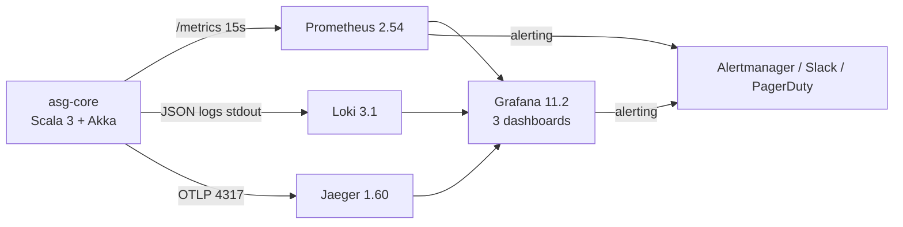

# Мониторинг ASG

> Документ описывает observability-стек Адаптивного семантического шлюза:
> три Grafana-дашборда (operational, service, business), алерты Prometheus
> P1/P2/P3, Loki-запросы (LogQL), трассировку Jaeger и определения SLO/SLI.

## Содержание

- [Обзор observability-стека](#обзор-observability-стека)
- [Grafana dashboards](#grafana-dashboards)
- [Prometheus alerts (P1/P2/P3)](#prometheus-alerts-p1p2p3)
- [Loki log queries (LogQL)](#loki-log-queries-logql)
- [Jaeger trace investigation](#jaeger-trace-investigation)
- [SLO / SLI определения](#slo--sli-определения)

---

## Обзор observability-стека



| Компонент    | Образ                          | Назначение                              |
|--------------|--------------------------------|-----------------------------------------|
| Prometheus 2.54 | `prom/prometheus:v2.54.1`    | Scrap метрик (15 s), retention 15d      |
| Grafana 11.2 | `grafana/grafana:11.2.0`       | Визуализация, alerting                  |
| Loki 3.1     | `grafana/loki:3.1.2`           | Агрегация логов                         |
| Jaeger 1.60   | `jaegertracing/all-in-one:1.60.0` | Distributed tracing (OTLP)         |
| Alertmanager  | `prom/alertmanager:v0.27.0`    | Роутинг алертов (P1→PagerDuty, P2→Slack)|

Локальные URL (docker-compose):
- Grafana: http://localhost:3000 (admin / admin)
- Prometheus: http://localhost:19090
- Loki: http://localhost:3100
- Jaeger UI: http://localhost:16686

Staging: `https://{grafana|prometheus|loki|jaeger}.asg-staging.smev.ru`
Production: `https://{grafana|prometheus|loki|jaeger}.asg.smev.ru`

---

## Grafana dashboards

Подготовлены 3 дашборда в `grafana/` (provisioned через ConfigMap).

### 1. Operational (operational)

**Файл:** `grafana/dashboard-operational.json`
**UID:** `asg-operational`
**Назначение:** SRE-команда — общее состояние системы, SLO-метрики.

| # | Panel                              | Тип          | PromQL                                                                 |
|---|------------------------------------|--------------|------------------------------------------------------------------------|
| 1 | Current RPS                       | Stat         | `sum(rate(asg_translate_requests_total[1m]))`                          |
| 2 | Error Rate                        | Stat         | `sum(rate(asg_translate_requests_total{outcome!="valid"}[5m])) / sum(rate(asg_translate_requests_total[5m]))` |
| 3 | p95 / p99 latency                 | Time series  | `histogram_quantile(0.95, rate(asg_translate_duration_seconds_bucket[5m]))` |
| 4 | Cache hit rate                    | Gauge        | `rate(asg_cache_hits_total[5m]) / (rate(asg_cache_hits_total[5m]) + rate(asg_cache_misses_total[5m]))` |
| 5 | 3-tier contour distribution       | Pie chart    | `sum by (contour) (rate(asg_translate_requests_total[5m]))`           |
| 6 | Pod count + HPA status            | Stat         | `kube_deployment_status_replicas{deployment="asg-core"}`              |
| 7 | JVM heap / GC                     | Time series  | `jvm_memory_bytes_used{area="heap"}`                                   |
| 8 | CPU / Memory                      | Time series  | `rate(container_cpu_usage_seconds_total{pod=~"asg-core-.*"}[5m])`     |
| 9 | SHACL violations (rate)           | Time series  | `sum by (shape) (rate(asg_shacl_violations_total[5m]))`                |
| 10| Availability (5-min sliding window)| Stat        | `1 - (sum(rate(asg_translate_requests_total{outcome="error"}[5m])) / sum(rate(asg_translate_requests_total[5m])))` |

**SLO пороги (светофор):**
- RPS: 🟢 <8000 / 🟡 8000-10000 / 🔴 >10000
- Error rate: 🟢 <0.5% / 🟡 0.5-5% / 🔴 >5%
- p95: 🟢 <500ms / 🟡 500-800ms / 🔴 >800ms
- Cache hit rate: 🟢 >80% / 🟡 70-80% / 🔴 <70%

### 2. Service (service)

**Файл:** `grafana/dashboard-service.json`
**UID:** `asg-service`
**Назначение:** ASG dev-team — внутренние метрики сервиса, кэша, валидации.

| # | Panel                              | Тип          | Источник                               |
|---|------------------------------------|--------------|----------------------------------------|
| 1 | Top-10 онтологий (по RPS)         | Bar chart    | `sum by (source_ontology) (rate(...))` |
| 2 | Cache hit/miss per minute          | Time series  | `rate(asg_cache_hits_total[1m])`       |
| 3 | Redis latency p95 (get/set)        | Time series  | `redis_commands_duration_seconds_total`|
| 4 | PostgreSQL connection pool        | Stat         | `pg_stat_activity_count`               |
| 5 | SHACL violations по шейпам         | Table        | `asg_shacl_violations_total{shape=...}`|
| 6 | OWL2RL reasoner executions         | Time series  | `asg_owl2rl_executions_total`          |
| 7 | Hot-L escalation → Learner          | Time series  | `asg_hotl_escalations_total`           |
| 8 | PROV-O audit records per minute   | Time series  | `asg_prov_records_total`               |
| 9 | gRPC vs REST split                 | Pie chart    | `sum by (protocol) (rate(...))`        |
| 10| JVM: thread count + deadlock alerts | Time series | `jvm_threads_state`                    |

### 3. Business (business)

**Файл:** `grafana/dashboard-business.json`
**UID:** `asg-business`
**Назначение:** Product owner / SLA-отдел — бизнес-метрики, SLA по
потребителям, популярные онтологии.

| # | Panel                              | Тип          | Источник                              |
|---|------------------------------------|--------------|---------------------------------------|
| 1 | Daily active consumers             | Stat         | `count(count by (consumer_id) (...))` |
| 2 | Requests per consumer (24h)        | Bar chart    | `sum by (consumer_id) (increase(...))`|
| 3 | Top-5 DL-queries                   | Table        | журнал запросов (через Loki)         |
| 4 | Consumer SLA (99% < 500ms)         | Gauge per consumer | `histogram_quantile(0.99, ...)` |
| 5 | Cache cost savings (per consumer)  | Stat         | расчётная метрика                     |
| 6 | Ontology coverage (mapped / total) | Table        | `count(mappings) / count(concepts)`   |
| 7 | SLA breaches (last 30 days)        | Annotation   | `slo:latency_p95_500ms` violations   |
| 8 | Monthly cost (Yandex Cloud)         | Stat         | Terraform outputs                     |

---

## Prometheus alerts (P1/P2/P3)

**Файл:** `prometheus/rules.yml` (там же — `alerts.yml` если включён отдельно).
Каждый алерт имеет метки `severity` (P1/P2/P3), `team`, `slo` и
аннотации с `summary` / `description` / `runbook_url`.

### P1 (critical — page immediately)

| Alert              | Condition (PromQL)                                 | Routing              |
|--------------------|----------------------------------------------------|----------------------|
| `ASGDown`          | `up{job="asg-core"} == 0 for 1m`                   | PagerDuty + SMS      |
| `ASGHighErrorRate` | `error_rate > 0.05 for 2m`                        | PagerDuty            |
| `ASGHighLatencyP99`| `histogram_quantile(0.99, ...) > 2000 for 5m`     | PagerDuty            |
| `ASGLowAvailability`| `availability < 0.995 for 5m`                    | PagerDuty            |
| `RedisDown`        | `up{job="redis"} == 0 for 1m`                     | PagerDuty            |
| `PostgresDown`     | `up{job="postgres"} == 0 for 1m`                   | PagerDuty            |

**Пример правила:**

```yaml
groups:
  - name: asg-p1-critical
    interval: 30s
    rules:
      - alert: ASGDown
        expr: up{job="asg-core"} == 0
        for: 1m
        labels:
          severity: P1
          team: sre
          slo: availability
        annotations:
          summary: "ASG is DOWN (instance {{ $labels.instance }})"
          description: "asg-core не отвечает на /metrics уже 1 минуту."
          runbook_url: "https://runbooks.asg.smev.ru/asg-down"
```

### P2 (warning — рабочие часы)

| Alert                       | Condition                                          |
|-----------------------------|----------------------------------------------------|
| `ASGHighLatencyP95`         | `p95 > 800ms for 5m` (1.6× SLO)                    |
| `ASGLowCacheHitRate`        | `cache_hit_rate < 0.70 for 10m`                    |
| `ASGHighCPU`                | `CPU > 80% for 5m`                                 |
| `ASGApproachingRPSLimit`    | `rps > 9000 for 5m` (90% от пика)                  |
| `ASGHighShaclViolations`    | `rate(violations[10m]) > 1`                         |
| `RedisMemoryNearLimit`      | `redis_memory_used / redis_memory_max > 0.85`      |
| `PostgresConnectionPoolSaturation` | `pg_connections / pg_max_connections > 0.7` |
| `DiskWillFillIn24h`         | `predict_linear(disk_free[1h], 24*3600) < 0`       |

Routing: Slack `#asg-alerts`, email `sre-oncall@smev.ru`.

### P3 (info — только лог)

| Alert                       | Condition                                          |
|-----------------------------|----------------------------------------------------|
| `ASGHotLContourEscalation`  | `increase(asg_hotl_escalations_total[10m]) > 5`    |
| `ASGSlowResponse`           | `p50 > 200ms for 10m`                              |
| `ASGHPAMaxedOut`            | `replicas == maxReplicas for 30m`                  |
| `ASGLowThroughput`          | `rps < 100 for 1h` (при expected > 1000)           |

Routing: только в Loki / Grafana annotations.

### Alertmanager routing rules

```yaml
# alertmanager.yml
route:
  group_by: ['alertname', 'job']
  group_wait: 30s
  group_interval: 5m
  repeat_interval: 4h
  receiver: 'slack-default'
  routes:
    - matchers: ['severity = "P1"']
      receiver: 'pagerduty-critical'
      group_wait: 0s   # P1 — мгновенно
    - matchers: ['severity = "P2"']
      receiver: 'slack-warnings'
    - matchers: ['severity = "P3"']
      receiver: 'null'   # только в Grafana

receivers:
  - name: 'pagerduty-critical'
    pagerduty_configs:
      - service_key: '${PAGERDUTY_KEY}'
  - name: 'slack-warnings'
    slack_configs:
      - channel: '#asg-alerts'
        api_url: '${SLACK_WEBHOOK}'
  - name: 'slack-default'
    slack_configs:
      - channel: '#asg-ops'
        api_url: '${SLACK_WEBHOOK}'
```

---

## Loki log queries (LogQL)

asg-core пишет JSON-логи в stdout (Logback JSON encoder). Promtail
(docker driver / Promtail sidecar) собирает их в Loki. Каждый log line
имеет следующие structured fields:

```json
{
  "ts": "2026-08-11T10:23:45.123Z",
  "level": "INFO",
  "logger": "ru.smev.asg.agents.ArbiterAgent",
  "thread": "asg-akka.actor.default-dispatcher-5",
  "requestId": "req-01HV7X9K...",
  "traceId": "5f4dcc3b5aa765d61d8327deb882cf99",
  "spanId": "1f9d6a2e",
  "consumer_id": "fns-isms",
  "message": "translate accepted: contour=hot-l, confidence=0.92",
  "outcome": "valid",
  "tookMs": 123
}
```

### Полезные LogQL-запросы

**Все ERROR-логи за последний час:**

```logql
{job="asg-core"} |= "error" | json | level="ERROR"
```

**Логи конкретного requestId (корреляция с trace):**

```logql
{job="asg-core"} | json | requestId="req-01HV7X9K2Y3M1N4P5Q6R7S8T9V"
```

**Логи с медленными запросами (tookMs > 1000):**

```logql
{job="asg-core"} | json | tookMs > 1000
```

**Группировка по consumer_id — топ-5 потребителей за час:**

```logql
sum by (consumer_id) (
  count_over_time({job="asg-core"} | json [1h])
)
```

**Поиск traceback'ов (multi-line):**

```logql
{job="asg-core"} |~ "(?i)(error|exception|stacktrace)" | json
```

**Фильтрация по SHACL-violation:**

```logql
{job="asg-core"} | json | logger="ru.smev.asg.verification.ShaclValidator" |= "Violation"
```

**Частота ошибок по потребителям (rate):**

```logql
sum by (consumer_id) (
  rate({job="asg-core"} | json | level="ERROR" [5m])
)
```

### Настройка Loki в Grafana

Datasource добавлен через provisioning (`grafana/provisioning/datasources/datasources.yml`):

```yaml
apiVersion: 1
datasources:
  - name: Loki
    type: loki
    access: proxy
    url: http://loki:3100
    jsonData:
      maxLines: 5000
      derivedFields:
        - name: TraceID
          matcherRegex: '"traceId":"(\w+)"'
          url: 'http://jaeger:16686/trace/$${__value.raw}'
```

При клике на traceId в логах → открывается Jaeger trace (correlation).

---

## Jaeger trace investigation

asg-core публикует OTLP-traces (OpenTelemetry SDK) в Jaeger через OTLP
HTTP endpoint `http://jaeger:4318`.

### Структура trace

```
[asg-core: POST /api/v1/translate]
├── RestApi.handleTranslate                     (12.4 ms)
│   ├── JwtAuthenticator.verify                  (0.8 ms)
│   └── ArbiterAgent.translate                   (10.2 ms)
│       ├── CacheManager.get                    (1.1 ms — MISS)
│       ├── MatcherAgent.match                  (5.7 ms)
│       │   ├── OntologyRegistry.getSource      (0.3 ms)
│       │   ├── OntologyRegistry.getTarget      (0.2 ms)
│       │   └── MappingRegistry.find            (4.9 ms — SQL)
│       ├── ValidatorAgent.validate             (3.1 ms)
│       │   ├── ShaclValidator.validate         (2.4 ms)
│       │   └── Owl2RlReasoner.reason           (0.6 ms)
│       └── CacheManager.put                    (0.3 ms)
```

### Поиск медленного запроса

1. В Grafana открыть дашборд Operational → panel "p95/p99 latency".
2. Найти всплеск на графике, кликнуть "Explore from here".
3. Перейти в Jaeger UI (http://localhost:16686) → Service: `asg-core`.
4. Найти trace по traceId (из Loki-лога или из метрики).
5. Развернуть span'ы — увидеть, какой компонент занял больше всего.

### Полезные Jaeger-запросы

- Все запросы медленнее 1s за последний час:
  ```http
  GET /api/traces?service=asg-core&operation=POST%20/api/v1/translate&tags={"error":true}&limit=20&lookback=1h
  ```

- Трейс по requestId (через tag):
  ```http
  GET /api/traces?service=asg-core&tags={"request.id":"req-01HV7X9K..."}
  ```

- Сравнение latencies по contour (hot-l vs learner):
  ```http
  GET /api/traces?service=asg-core&operation=ArbiterAgent.translate&tags={"contour":"learner"}
  ```

### Корреляция trace ↔ log ↔ metric

| Источник        | Что показывает                | Идентификатор          |
|-----------------|------------------------------|------------------------|
| Prometheus      | aggregate p95/p99 latency     | `le` buckets          |
| Loki            | structured log per requestId  | `requestId` / `traceId`|
| Jaeger          | детальный span tree          | `traceId` / `spanId`   |

`traceId` присутствует во всех трёх источниках — это ключ корреляции.

---

## SLO / SLI определения

### SLO (Service Level Objectives)

ASG декларирует следующие SLO (внешние обязательства перед потребителями):

| ID     | SLO                                                | Target         | Window   |
|--------|----------------------------------------------------|----------------|----------|
| SLO-1  | Availability                                        | 99.5%          | 30 дней  |
| SLO-2  | Translate latency p95 (cache-miss)                 | ≤ 500 ms       | 30 дней  |
| SLO-3  | Translate latency p95 (cache-hit)                  | ≤ 50 ms        | 30 дней  |
| SLO-4  | Translate latency p99 (overall)                    | ≤ 1000 ms      | 30 дней  |
| SLO-5  | Error rate (5xx + 422)                              | ≤ 0.5%         | 30 дней  |
| SLO-6  | Throughput (peak)                                  | ≥ 10000 RPS    | (capacity)|
| SLO-7  | SHACL-validation pass rate                          | ≥ 99%          | 30 дней  |

### SLI (Service Level Indicators)

SLI — измеримая метрика, на которой базируется SLO.

| SLO  | SLI (PromQL)                                                          |
|------|----------------------------------------------------------------------|
| SLO-1| `1 - (sum(rate(asg_translate_requests_total{outcome="error"}[5m])) / sum(rate(asg_translate_requests_total[5m])))` |
| SLO-2| `histogram_quantile(0.95, rate(asg_translate_duration_seconds_bucket{cached="false"}[5m]))` |
| SLO-3| `histogram_quantile(0.95, rate(asg_translate_duration_seconds_bucket{cached="true"}[5m]))` |
| SLO-4| `histogram_quantile(0.99, rate(asg_translate_duration_seconds_bucket[5m]))` |
| SLO-5| `sum(rate(asg_translate_requests_total{outcome=~"error|invalid"}[5m])) / sum(rate(asg_translate_requests_total[5m]))` |
| SLO-6| `sum(rate(asg_translate_requests_total[1m]))`                       |
| SLO-7| `1 - (sum(rate(asg_shacl_violations_total[5m])) / sum(rate(asg_translate_requests_total[5m])))` |

### Error budget

При SLO 99.5% доступности в 30 дней:
- Total minutes: 30 × 24 × 60 = 43 200 min
- Allowed downtime: 0.5% × 43 200 = 216 min (3 ч 36 мин в месяц)

Trackится через recording rule `asg:error_budget_remaining`:

```yaml
groups:
  - name: asg-error-budget
    rules:
      - record: asg:error_budget_burn_rate
        expr: |
          sum(rate(asg_translate_requests_total{outcome="error"}[1h]))
          /
          (0.005 * sum(rate(asg_translate_requests_total[1h])))
      - alert: ASGErrorBudgetBurnFast
        expr: asg:error_budget_burn_rate > 14.4    # 14.4 = 1h burn за 2% budget
        for: 5m
        labels: { severity: P2, slo: availability }
```

### Burn-rate alerting

| Burn rate | Window | Значение                          | Действие               |
|-----------|--------|-----------------------------------|------------------------|
| > 14.4    | 1h     | Тратим 2% budget/час              | P2 alert + freeze deploy |
| > 6       | 6h     | Тратим 2% budget/6 часов          | P2 alert              |
| > 1       | 3 days | На пути пробить SLO              | P3 alert + план       |
| > 0       | 30d    | Бюджет исчерпан                   | Разбор с PO            |

---

## Metrics catalogue

Полный список метрик, экспортируемых asg-core на `/api/v1/metrics`.

### Counter (monothonic)

| Metric                          | Labels                       |
|---------------------------------|------------------------------|
| `asg_translate_requests_total` | `outcome`, `contour`         |
| `asg_cache_hits_total`         | (none)                       |
| `asg_cache_misses_total`       | (none)                       |
| `asg_shacl_violations_total`   | `shape`, `severity`         |
| `asg_hotl_escalations_total`   | `reason`                     |
| `asg_prov_records_total`       | (none)                       |
| `asg_owl2rl_executions_total`  | `result` (`consistent`/`inconsistent`) |

### Histogram

| Metric                          | Buckets (seconds)                         |
|----------------------------------|-------------------------------------------|
| `asg_translate_duration_seconds` | 0.005, 0.01, 0.025, 0.05, 0.1, 0.25, 0.5, 1, 2.5, 5, 10 |

### Gauge

| Metric                          | Описание                                |
|---------------------------------|-----------------------------------------|
| `asg_ontology_count`           | Загруженных онтологий                    |
| `asg_mapping_count`            | Зарегистрированных маппингов             |
| `asg_cache_size`               | Записей в LRU-кэше                       |
| `jvm_memory_bytes_used`        | JVM heap/non-heap (Micrometer)          |
| `jvm_threads_state`            | Потоки по состоянию (NEW/RUNNABLE/...)  |
| `process_cpu_usage`            | CPU usage (0-1)                          |

### Default JVM / Akka / system

asg-core автоматически экспортирует все стандартные JVM-метрики (через
Micrometer + Prometheus registry) и Akka-метрики (через Cinnamon — опц.).

Полный список с описанием — в [source: `asg-core/src/main/scala/ru/smev/asg/api/MetricsExporter.scala`](../asg-core/src/main/scala/ru/smev/asg/api/).
