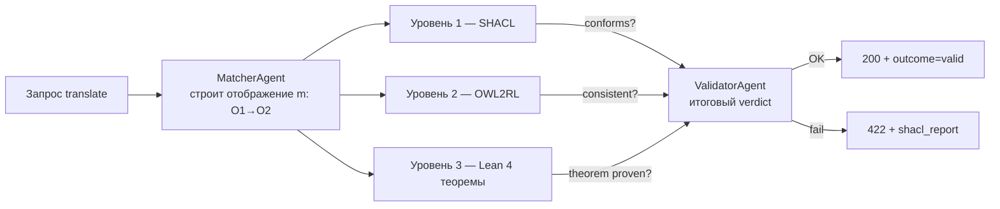

# Руководство по верификации ASG

> Документ описывает **трёхуровневую верификацию** Адаптивного семантического
> шлюза: SHACL (структурные ограничения), OWL2RL (консистентность онтологии),
> Lean 4 (формальные доказательства Теоремы 1.1). Также содержит практические
> инструкции: как добавлять новые SHACL-шейпы, как пользоваться OWL2RL-выведением,
> какие SPARQL-запросы применять и как запускать Lean 4-верификацию.

## Содержание

- [Обзор трёхуровневой верификации](#обзор-трёхуровневой-верификации)
- [Уровень 1 — SHACL-шейпы](#уровень-1--shacl-шейпы)
  - [OM-1: сохранение иерархии концептов](#om-1-сохранение-иерархии-концептов)
  - [OM-2-union / OM-2-intersection: сохранение объединения/пересечения](#om-2-union--om-2-intersection-сохранение-объединенияпересечения)
  - [OM-3-role: сохранение ролей (object properties)](#om-3-role-сохранение-ролей-object-properties)
  - [SS-2': структурная консистентность отображения](#ss-2-структурная-консистентность-отображения)
  - [Как добавить новый SHACL-шейп](#как-добавить-новый-shacl-шейп)
- [Уровень 2 — OWL2RL-выведение](#уровень-2--owl2rl-выведение)
- [SPARQL-запросы для верификации](#sparql-запросы-для-верификации)
- [Уровень 3 — Формальная верификация Lean 4](#уровень-3--формальная-верификация-lean-4)
- [CI-интеграция](#ci-интеграция)

---

## Обзор трёхуровневой верификации

ASG применяет **три уровня проверки** для каждого результата трансляции.
Каждый уровень закрывает свой класс ошибок и не дублирует остальные:



| Уровень | Что проверяет                              | Технология                | Когда выполняется              |
|---------|--------------------------------------------|---------------------------|--------------------------------|
| 1       | Структурные ограничения на инстансах        | SHACL 1.1 + Jena SHACL API| На каждый запрос translate     |
| 2       | Консистентность онтологии (open-world)     | OWL2RL + Jena reasoner    | На каждый запрос + nightly     |
| 3       | Теоретические свойства морфизма (Theorem 1.1)| Lean 4 + Mathlib4         | Nightly + на PR в `TOI/`       |

Уровень 1 — дешёвый (миллисекунды), level 2 — средний (десятки мс), level 3 —
тяжёлый (минуты на сборку Mathlib4), поэтому level 3 выполняется только
в CI/nightly, а в runtime используется закэшированный результат
(`compiled_ok=true`).

---

## Уровень 1 — SHACL-шейпы

SHACL (Shapes Constraint Language, W3C Recommendation 2017) — язык для
описания структурных ограничений на RDF-данные. В ASG используется для
**runtime-валидации** каждого результата трансляции: если маппинг
нарушает SHACL-форму, запрос получает `outcome=invalid` и HTTP 422.

### Каталог шейпов

| Идентификатор              | Файл                          | Что проверяет                                              |
|---------------------------|-------------------------------|-----------------------------------------------------------|
| `oi:OM1HierarchyShape`    | `shapes/om1-hierarchy.ttl`    | Сохранение иерархии концептов (C ⊑ D ⟹ m(C) ⊑ m(D))        |
| `oi:OM2UnionShape`        | `shapes/om2-union.ttl`        | Сохранение объединения (m(C ⊔ D) = m(C) ⊔ m(D))            |
| `oi:OM2IntersectionShape` | `shapes/om2-intersection.ttl` | Сохранение пересечения (m(C ⊓ D) = m(C) ⊓ m(D))            |
| `oi:OM3RoleShape`          | `shapes/om3-role.ttl`         | Сохранение ролей (object properties)                       |
| `oi:SS2PrimeShape`        | `sparql/ss2-verify.rq` (SPARQL) | Структурная консистентность (см. ниже)                  |

### OM-1: сохранение иерархии концептов

**Теоретическое условие:** для любых концептов C, D из O₁, если
C ⊑ D (subClassOf), то m(C) ⊑ m(D) (образ также находится в
subClassOf-отношении).

**SHACL-инкарнация** (`shapes/om1-hierarchy.ttl`):

```turtle
oi:OM1HierarchyShape a sh:NodeShape ;
  sh:targetClass toi:OntologyMorphism ;
  sh:property [
    sh:path (toi:mapsConcept [sh:inversePath rdfs:subClassOf]) ;
    sh:node oi:MappedConceptShape ;   # проверяем образ
    sh:message "Concept hierarchy not preserved"@ru ;
  ] .

oi:MappedConceptShape a sh:NodeShape ;
  sh:property [
    sh:path [sh:inversePath toi:mapsConcept] ;
    sh:class toi:OntologyConcept ;
    sh:node oi:HierarchyPreservationShape ;
  ] .
```

**Как читать:** для каждого `toi:OntologyMorphism`, берём все пары
(`C`, `m(C)`) через `toi:mapsConcept`. Для каждой пары проверяем: если
`C` имеет `rdfs:subClassOf D`, то `m(C)` должен иметь `rdfs:subClassOf m(D)`.

**Пример нарушения:**
- Онтология O₁: `MoscowResident ⊑ RussianResident`.
- Маппинг: `MoscowResident → tax:Taxpayer`, `RussianResident → tax:Person`.
- Ожидание: `tax:Taxpayer ⊑ tax:Person`.
- Реальность: `tax:Taxpayer ⊒ tax:Person` (Taxpayer — более широкое).
- → violation OM-1, запрос отклонён.

### OM-2-union / OM-2-intersection: сохранение объединения/пересечения

**OM-2-union:** для C, D из O₁, `m(C ⊔ D) = m(C) ⊔ m(D)`.

**OM-2-intersection:** для C, D из O₁, `m(C ⊓ D) = m(C) ⊓ m(D)`.

Эти две формы реализованы через `sh:or` (union) и `sh:and` (intersection)
комбинаторы. Пример для intersection:

```turtle
oi:OM2IntersectionShape a sh:NodeShape ;
  sh:targetSubjectsOf toi:mapsConcept ;
  sh:property [
    sh:path toi:mapsConcept ;
    sh:qualifiedValueShape [
      sh:and (
        [ sh:class toi:IntersectionOfPair ]
        [ sh:path toi:sourceIntersection ; sh:minCount 1 ]
      )
    ] ;
    sh:qualifiedMinCount 1 ;
    sh:message "Intersection not preserved under mapping"@ru ;
  ] .
```

### OM-3-role: сохранение ролей (object properties)

**Условие:** для любой роли R в O₁, если R(a, b), то R(m(a), m(b)) в O₂
(при условии, что отображение ролей R → R' явно задано).

```turtle
oi:OM3RoleShape a sh:NodeShape ;
  sh:targetClass toi:RoleMorphism ;
  sh:property [
    sh:path (toi:mapsRole [sh:inversePath rdfs:subPropertyOf]) ;
    sh:node oi:MappedRoleShape ;
    sh:message "Role hierarchy not preserved"@ru ;
  ] .
```

### SS-2': структурная консистентность отображения

**Условие (Structural Soundness 2'):** отображение m не должно создавать
«висячих» ссылок — каждый маппированный концепт должен иметь валидное
определение в целевой онтологии.

Реализуется **SPARQL-запросом** (`sparql/ss2-verify.rq`) — SHACL плохо
справляется с跨-онтологическими проверками:

```sparql
# sparql/ss2-verify.rq
PREFIX toi: <https://smev.ru/toi/ontology#>
PREFIX rdfs: <http://www.w3.org/2000/01/rdf-schema#>

SELECT ?mapping ?concept ?target WHERE {
  ?mapping a toi:OntologyMorphism ;
          toi:mapsConcept ?pair .
  ?pair toi:sourceConcept ?concept ;
        toi:targetConcept ?target .
  FILTER NOT EXISTS {
    ?target a owl:Class .
  }
}
```

Если результат запроса непустой — найдены маппинги, чьи target-концепты
не определены в O₂ → SS-2' violation.

---

### Как добавить новый SHACL-шейп

Шаги для добавления нового ограничения (например, «каждый маппированный
концепт должен иметь rdfs:label на русском и английском»):

1. **Создать файл** в `shapes/` с говорящим именем:
   ```bash
   cat > shapes/multilingual-label.ttl <<'EOF'
   @prefix sh: <http://www.w3.org/ns/shacl#> .
   @prefix oi: <https://smev.ru/toi/ontology#> .
   @prefix rdfs: <http://www.w3.org/2000/01/rdf-schema#> .

   oi:MultilingualLabelShape a sh:NodeShape ;
     sh:targetClass oi:MappedConcept ;
     sh:property [
       sh:path rdfs:label ;
       sh:minCount 2 ;
       sh:languageIn ("ru" "en") ;
       sh:uniqueLang true ;
       sh:message "Mapped concept must have rdfs:label in ru AND en"@ru ;
     ] .
   EOF
   ```

2. **Локальная проверка** через Apache Jena CLI:
   ```bash
   # Парсинг — синтаксическая валидность
   riot --validate shapes/multilingual-label.ttl

   # Тест-кейс: применить шейп к онтологии
   shacl validate \
     --shapes shapes/multilingual-label.ttl \
     --data ontologies/registration/v1.0.owl \
     --text
   ```

3. **Добавить unit-тест** в `asg-core/src/test/scala/ru/smev/asg/verification/`:
   ```scala
   // ShaclMultilingualLabelSpec.scala
   "ShaclValidator" should "reject mapped concept without ru+en labels" in {
     val validator = new ShaclValidator(Seq(
       "shapes/multilingual-label.ttl"
     ))
     val badData = loadRdf("/fixtures/concept-no-label.ttl")
     val report  = validator.validate(badData)
     report.conforms shouldBe false
     report.violations should have size 1
     report.violations.head.shape.value shouldBe "oi:MultilingualLabelShape"
   }
   ```

4. **CI-интеграция** — новый шейп автоматически подхватывается
   `shacl-validate.yml` (ищет все `shapes/*.ttl`). Локально проверить:
   ```bash
   # Имитация CI-проверки
   find shapes -name '*.ttl' -exec riot --validate {} \;
   ```

5. **Документация** — добавить строку в таблицу «Каталог шейпов» выше.

---

## Уровень 2 — OWL2RL-выведение

В отличие от SHACL (closed-world data validation), OWL2RL — это правило
forward-chaining: из набора утверждений он выводит **новые** факты и
проверяет консистентность онтологии (open-world assumption).

### Зачем нужен в ASG

- **Консистентность онтологии:** если в онтологии есть противоречие
  (например, концепт объявлен как `Person ⊑ ¬Person`), SHACL это не
  найдёт — он проверяет только формы. OWL2RL-reasoner даст `InconsistentOntology`.
- **Выведение новых фактов:** если в O₂ есть `Person ⊑ Human`, а в
  данных есть `Ivan a Person`, то reasoner добавит `Ivan a Human` — это
  может активировать дополнительные SHACL-формы.
- **Эквивалентность классов:** `owl:equivalentClass` разрешается reasoner'ом,
  SHACL его не понимает.

### Использование (Scala API)

```scala
// asg-core/src/main/scala/ru/smev/asg/verification/Owl2RlReasoner.scala
import org.apache.jena.reasoner.ReasonerRegistry
import org.apache.jena.ontology.OntModelSpec

class Owl2RlReasoner:

  /** Строит inference-модель поверх исходной онтологии. */
  def reason(model: Model): InfModel =
    val reasoner = ReasonerRegistry.getOWLReasoner
    val infModel = ModelFactory.createInfModel(reasoner, model)
    // Проверка консистентности.
    if infModel.isInconsistent then
      throw new IllegalStateException("Ontology is inconsistent")
    infModel

  /** Возвращает все выведенные факты, отсутствующие в исходной модели. */
  def deducedStatements(model: Model): Set[Statement] =
    val inf = reason(model)
    inf.difference(model).listStatements.toSet
```

### CI-интеграция

Nightly-проверка всех онтологий в `ontologies/`:

```bash
#!/bin/bash
# scripts/owl2rl-nightly-check.sh
for onto in ontologies/*/*.owl; do
  echo "→ OWL2RL: $onto"
  OUTPUT=$(arq --data "$onto" --query sparql/check-consistency.rq --results=csv)
  if echo "$OUTPUT" | grep -q "inconsistent"; then
    echo "::error file=$onto::OWL2RL detected inconsistency"
    exit 1
  fi
done
```

### Когда не использовать OWL2RL

- Если онтология большая (>10⁵ аксиом) — reasoner может занимать минуты.
  Тогда кэшировать результат (`asg:ontologyValidatedAt` timestamp).
- Если нужна SHACL-like валидация конкретных инстансов — SHACL быстрее
  и точнее.

---

## SPARQL-запросы для верификации

ASG содержит два SPARQL-верификатора в каталоге `sparql/`:

### ss1-verify.rq — Structural Soundness 1

Проверяет, что каждый концепт исходной онтологии O₁ имеет образ в O₂
(если хотя бы один концепт не отмапплен — маппинг неполный).

```sparql
PREFIX toi: <https://smev.ru/toi/ontology#>
PREFIX owl: <http://www.w3.org/2002/07/owl#>

SELECT ?concept WHERE {
  ?concept a owl:Class .
  FILTER NOT EXISTS {
    ?mapping a toi:OntologyMorphism ;
            toi:mapsConcept ?pair .
    ?pair toi:sourceConcept ?concept .
  }
}
```

**Ожидаемый результат:** пустой (или содержащий только заведомо
неприменимые концепты, помеченные `asg:mappingExempt`).

### ss2-verify.rq — Structural Soundness 2

Проверяет, что каждый маппированный target-концепт существует в O₂
(«висячие» ссылки).

```sparql
PREFIX toi: <https://smev.ru/toi/ontology#>
PREFIX owl: <http://www.w3.org/2002/07/owl#>

SELECT ?mapping ?concept ?target WHERE {
  ?mapping a toi:OntologyMorphism ;
          toi:mapsConcept ?pair .
  ?pair toi:sourceConcept ?concept ;
        toi:targetConcept ?target .
  FILTER NOT EXISTS { ?target a owl:Class . }
}
```

### Полезные паттерны

**Найти все пары эквивалентных концептов:**

```sparql
SELECT ?c1 ?c2 WHERE {
  ?c1 owl:equivalentClass ?c2 .
  FILTER(?c1 != ?c2)
}
```

**Найти концепты без rdfs:label:**

```sparql
SELECT ?c WHERE {
  ?c a owl:Class .
  FILTER NOT EXISTS { ?c rdfs:label ?lbl . }
}
```

**Подсчёт нарушений по шейпам:**

```sparql
PREFIX sh: <http://www.w3.org/ns/shacl#>
SELECT ?shape (COUNT(?v) AS ?count) WHERE {
  ?report a sh:ValidationReport ;
          sh:result ?v .
  ?v sh:sourceShape ?shape .
} GROUP BY ?shape ORDER BY DESC(?count)
```

### Выполнение SPARQL локально

```bash
# Через Jena arq
arq --data ontologies/registration/v1.0.owl \
    --query sparql/ss1-verify.rq \
    --results=csv

# Через Jena Fuseki UI
# http://localhost:3030/asg/query (POST textarea)
```

---

## Уровень 3 — Формальная верификация Lean 4

### Что формализуется

Теорема 1.1 (монография Салбьева А. Т., §1.1):

> **Теорема 1.1.** Пусть m: O₁ → O₂ — морфизм онтологий, сохраняющий
> интерпретации (то есть для любой интерпретации I₁ модели O₁ найдётся
> интерпретация I₂ модели O₂ такая, что для любого концепта C и любого
> x ∈ Δ^I₁: x ∈ C^I₁ ⟺ x ∈ m(C)^I₂). Тогда:
> 1. m сохраняет иерархию: C ⊑ D ⟹ m(C) ⊑ m(D).
> 2. m сохраняет объединение: m(C ⊔ D) = m(C) ⊔ m(D).
> 3. m сохраняет пересечение: m(C ⊓ D) = m(C) ⊓ m(D).
> 4. m сохраняет дополнение: m(¬C) = ¬m(C).
> 5. m сохраняет роли (object properties): R(a, b) ⟺ m(R)(m(a), m(b)).

Формализация выполнена на Lean 4 в каталоге `TOI/`. Используется Mathlib4
для теории категорий, топологии (Priestley-пространства), Stone duality.

### Структура каталога TOI/

```
TOI/
├── TOI.lean                  — корневой модуль (импортирует всё)
├── Axioms.lean               — аксиомы онтологий и морфизмов
├── Theorems/
│   ├── T11_Infinite.lean     — Теорема 1.1 для бесконечных областей
│   └── T11_Finite.lean       — Теорема 1.1 для конечных областей
├── Lemmas/
│   ├── TopPreserved.lean     — лемма о сохранении ⊤ (Top concept)
│   ├── RoleRestrict.lean     — лемма о сохранении ролей (∃R.C)
│   ├── NegPreserved.lean     — лемма о сохранении ¬C
│   └── BoolExt.lean          — Boolean extensionality
└── Countermodels/
    └── A.lean                — контрмодель: показывает, что при
                                нарушении условий Теоремы 1.1
                                заключение ложно.
```

### Запуск Lean 4 локально

```bash
# 1. Установить elan (Lean toolchain manager)
curl -fsSL https://raw.githubusercontent.com/leanprover/elan/master/elan-init.sh | sh
source $HOME/.cargo/env   # или перелогиниться

# 2. Проверить установку
lean --version   # Lean 4.14+
lake --version

# 3. Перейти в корень репозитория
cd asg-repository

# 4. Загрузить Mathlib4 (первый запуск ~5 минут, ~5 GB)
lake update

# 5. Сборка — верификация всех теорем
lake build
# Ожидаемый вывод: [Build/Info] TOI.Theorems.T11_Infinite ... Compiled
#                  [Build/Info] TOI.Theorems.T11_Finite   ... Compiled
# Если есть ошибка — см. ниже.

# 6. (Опционально) Проверить отдельную теорему
lake env lean TOI/Theorems/T11_Infinite.lean
```

### Что ожидать

| Сценарий                          | Вывод `lake build`                 | Что значит                              |
|-----------------------------------|------------------------------------|----------------------------------------|
| ✅ Успех                          | `Build successful`                 | Все теоремы доказаны — код корректен   |
| ❌ Ошибка в доказательстве         | `unsolved goals` + позиция         | Доказательство неполное — нужно дописать |
| ❌ Тайпчек ошибся                  | `type mismatch, ...`               | Типы не сходятся — пересмотреть тактику |
| ❌ Контрмодель найдена             | `Counterexample found`              | Условия теоремы слабее, чем утверждалось|

### Пример успешного вывода

```
[Build/Info] TOI.Axioms.lean ... Compiled
[Build/Info] TOI.Lemmas.TopPreserved.lean ... Compiled
[Build/Info] TOI.Lemmas.RoleRestrict.lean ... Compiled
[Build/Info] TOI.Lemmas.NegPreserved.lean ... Compiled
[Build/Info] TOI.Lemmas.BoolExt.lean ... Compiled
[Build/Info] TOI.Theorems.T11_Infinite.lean ... Compiled
[Build/Info] TOI.Theorems.T11_Finite.lean ... Compiled
[Build/Info] TOI.Countermodels.A.lean ... Compiled
[Build/Info] TOI.lean ... Compiled
Build successful
```

### Пример ошибки

```
TOI/Theorems/T11_Infinite.lean:42:8: error: unsolved goals
case preserveHierarchy
C D : OntologyConcept
h : C ⊑ D
⊢ m(C) ⊑ m(D)
```

Эта ошибка означает: в доказательстве теоремы о сохранении иерархии
осталась «дыра» — Lean не смог автоматически свести `m(C) ⊑ m(D)` к
известным леммам. Нужно явно применить тактику `apply TopPreserved.lemma`
или дополнить гипотезу.

### CI-интеграция

См. [`.github/workflows/lean-verify.yml`](../.github/workflows/lean-verify.yml):
nightly в 03:00 UTC + на каждый PR, затрагивающий `TOI/`.

Кэширование:
- `.lake/build` — построенные `.olean`-файлы (incremental).
- `.lake/packages/mathlib` — сам Mathlib4 (~5 GB).

При неудаче артефакт `lean-build-logs-<run_id>` содержит полный лог —
можно скачать и проанализировать локально.

### Обновление Mathlib4

Mathlib4 обновляется несколько раз в неделю. Чтобы обновить:

```bash
# 1. Обновить lake-manifest.json (новый SHA Mathlib4)
lake update

# 2. Локально прогнать сборку (могут быть breaking changes)
lake build

# 3. Если сборка упала — поправить доказательства

# 4. Закоммитить обновлённые lake-manifest.json + правки
git add lake-manifest.json TOI/
git commit -m "chore(lean): bump Mathlib4 to <new-sha>"
```

> **Внимание:** Обновление Mathlib4 — breaking change, должен быть
> отдельным PR с ревью. Не смешивать с feature-изменениями.

---

## CI-интеграция

Все три уровня верификации запускаются в GitHub Actions:

| Workflow                  | Уровень     | Когда                                    |
|---------------------------|-------------|------------------------------------------|
| `ci.yml` Stage 3 (unit-test)| 1, 2       | На каждый push/PR в main/develop         |
| `shacl-validate.yml`      | 1 (SHACL)   | На каждый push/PR, затрагивающий shapes/ |
| `lean-verify.yml`         | 3 (Lean)    | Nightly 03:00 UTC + на PR в TOI/        |
| `economics-check.yml`     | (не относится к верификации ASG, но к NPV/IRR/BCR-модели) | На push в economics/ |

См. README → [Testing](../README.md#тестирование).
